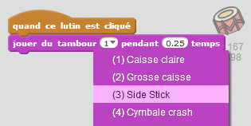
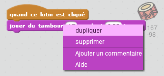

## Défi: Améliorer ton tambour

Peux-tu changer le son que fait le tambour lorsque l'on clique dessus ?



Can you also get the drum to make a sound when the space bar is pressed? You'll need to use this `event`{:class="block3events"} block:

```blocks3
quand la touche [espace] est pressée
```

If you want to copy your existing code, right-click on it and then click on **duplicate**.

