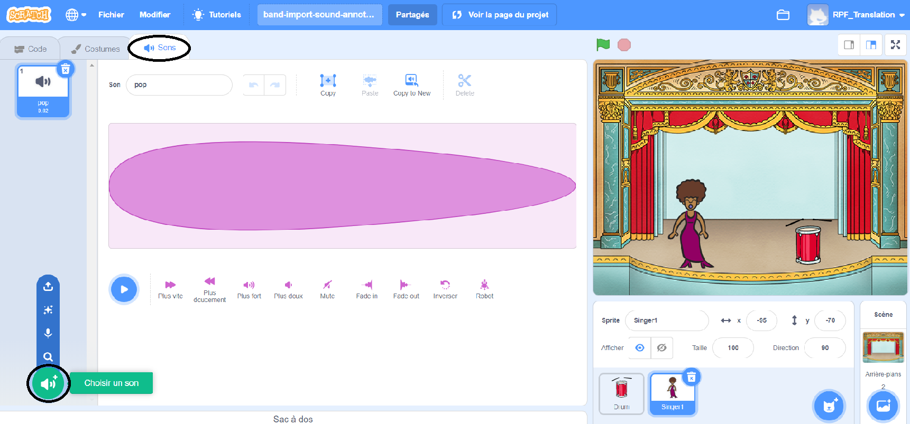
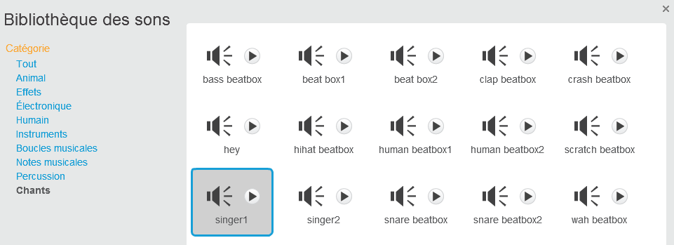

## Créer un chanteur

Maintenant, tu vas ajouter un chanteur à ton groupe !

\--- task \---

Ajouter un sprite chanteur à ta scène.


[[[generic-scratch3-sprite-from-library]]]

\--- /task \---

\--- task \---

Avant de pouvoir faire chanter le chanteur, tu dois ajouter un son à ton sprite chanteur. Assure-toi d’avoir sélectionné ton sprite chanteur, puis clique sur l’onglet Sons, puis sur ** Choisir un son de la bibliothèque** :



\--- /task \---

\--- task \---

Clique sur **Voix** dans la liste en haut, puis choisis un son à ajouter à ton sprite.



\--- /task \---

\--- task \---

Pour utiliser le son, ajoute les blocs de code suivants à ton sprite chanteur:

```blocks3
lorsque ce sprite est cliqué
joue le son (singer1 v) jusqu'à ce qu'il soit terminé
```

\--- /task \---

\--- task \---

Clique sur ton chanteur sur la scène et regarde ce qui se passe. Est-ce qu'elle chante ?

\--- /task \---