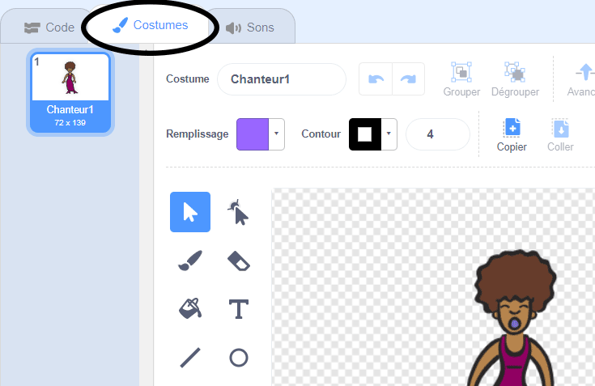
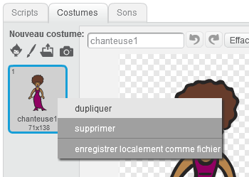
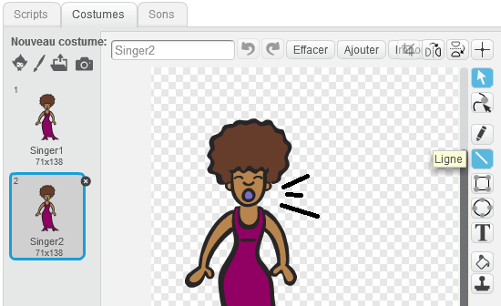
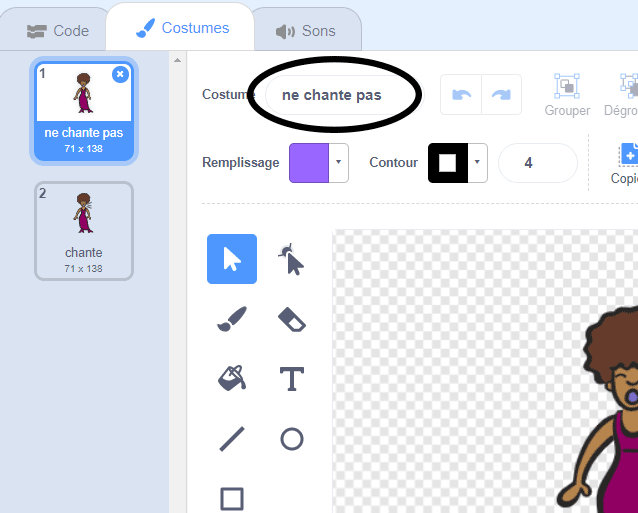

## Costumes

Maintenant, tu vas faire en sorte que l'on voit que ton chanteur ait l'air de chanter !

\--- task \---

Tu peux également modifier l'aspect de ton sprite chanteur en cliquant dessus et en créant un nouveau costume. Clique sur l'onglet Costumes, et tu verras le costume du chanteur.



\--- /task \---

\--- task \---

Fais un clic droit sur le costume, puis clique sur **dupliquer** pour créer une copie du costume.



\--- /task \---

\--- task \---

Clique sur le nouveau costume (appelé 'Chanteur2'), puis sélectionne l'outil ligne et dessine des lignes pour donner l'impression que ton chanteur émet un son.



\--- /task \---

\--- task \---

Les noms des costumes ne sont pas très utiles pour le moment. Tape dans les boîtes de texte des costumes pour changer leurs noms à 'ne chante pas' et 'chante'.



\--- /task \---

\--- task \---

Maintenant que tu as deux costumes différents pour ton chanteur, tu peux choisir quel costume est affiché ! Ajoute ces deux blocs de code à ton sprite chanteur:

```blocks3
lorsque ce sprite est cliqué
+ bascule le costume sur (chanter v)
jouer du son (singer1 v) jusqu'à ce que l'opération soit terminée
+ basculer costume sur (ne pas chanter v)
```

Le bloc de code pour changer le costume est dans la section `Apparence`{:class="block3looks"}.

\--- /task \---

\--- task \---

Clique sur ta chanteuse sur la scène. Est-ce qu'elle semble en train de chanter ?

\--- /task \---

\--- task \---

Maintenant tu vas faire en sorte que ton tambour ait l'air d'être frappé!


- Utilise les instructions pour changer le costume de ton sprite chanteur pour t'aider.

N'oublie pas de tester que ton nouveau code fonctionne!

\--- /task \---