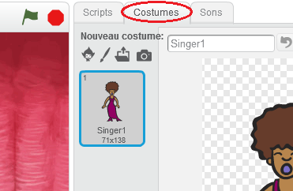

## Costumes

Fais en sorte que l'on voit que ton chanteur ait l'air de chanter !

+ Tu peux également modifier l'aspect de ton lutin chanteur en cliquant dessus et en créant un nouveau costume. Clique sur l'onglet Costumes, et tu verra l'image du chanteur.
    
    

+ Fait un clic droit sur le costume, puis clique sur **dupliquer** pour créer une copie du costume.
    
    

+ Clique sur le nouveau costume (appelé 'Singer2'), puis sélectionne l'outil ligne et dessine des lignes pour donner l'impression que ton chanteur émet un son.
    
    

+ Les noms des costumes ne sont pas très utiles pour le moment. Renomme les deux costumes afin qu'ils s'appellent 'ne pas chanter' et 'chanter' en tapant le nouveau nom de chaque costume dans la zone de texte.
    
    

+ Maintenant que tu as deux costumes différents pour ton chanteur, tu peux choisir quel costume est affiché ! Ajoute ces deux blocs à ton chanteur:
    
    
    
    Le bloc de code pour changer le costume est dans le `Apparence` {: class = "blocklooks"} section.

+ Clique sur ton chanteur. Est-ce qu'il a l'air de chanter?