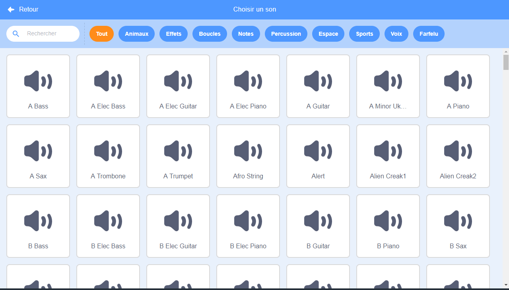
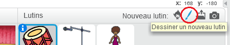
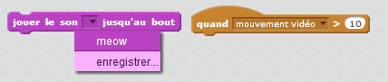

## Défi: Améliore ton groupe

Utilise ce que tu as appris dans ce projet pour créer ton propre groupe! Tu peux créer tous les instruments que tu aimes - regarde les instruments disponibles et les sons pour te donner des idées.



```blocks3
when this sprite clicked
set instrument to ((1) Piano v)
play note (60) for (0.25) beats
```

Tes instruments ne doivent pas forcément être réalistes cependant. Par exemple, Tu pourrais créer un piano fait de muffins!


Tu peux utiliser plus de sprite de la bibliothèque, et tu peux aussi peindre tes propres sprites!



--- collapse ---
---
title: Pourquoi mon sprite «saute» quand il change de costume?
---

Lorsque tu crées ton propre sprite, tu peux constater que lorsque tu cliques dessus, celui-ci «saute» lorsqu'il change de costume. C'est parce que les deux costumes ne sont pas centrés au même endroit.

Pour résoudre ce problème, assure-toi que les centres des costumes de tes sprites sont les mêmes.

--- /collapse ---

Si tu as un microphone, tu peux enregistrer tes propres sons, ou tu peux même utiliser une webcam pour frapper tes instruments!

