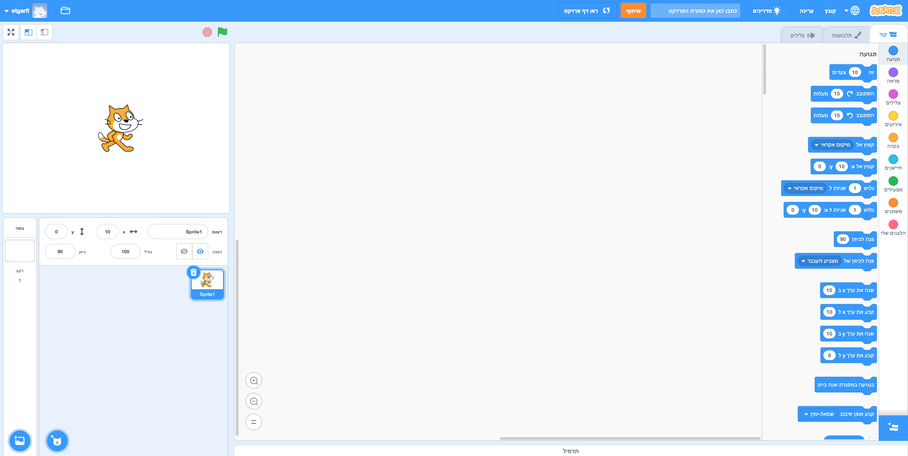
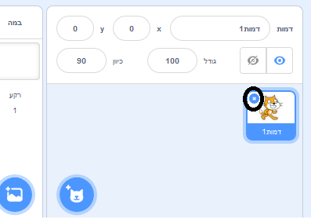
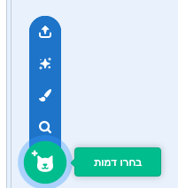
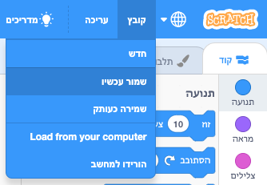

## דמויות

לפני שתוכל להתחיל לקודד, יהיה עליך להוסיף 'משהו ' לקוד. ב Scratch, "משהו" כאלה נקראים ** דמויות **.

\--- task \--- פתח פרוייקט חדש של Scratch.

**Online:** open a new online Scratch project at [rpf.io/scratch-new](http://rpf.io/scratch-new){:target="_blank"}.

** לא מקוון: ** פתח פרוייקט חדש בעורך הלא מקוון.

אם עליך להוריד ולהתקין את העורך הלא מקוון של Scratch, תוכל למצוא אותו בכתובת [ rpf.io/scratchoff ](http://rpf.io/scratchoff) {:target="_blank"}.

זה נראה כך:

 \--- / task \--- \--- task \--- דמות החתול שאתה יכול לראות הוא קוד סקראטץ. אתה לא תזדקק לו במשחק הזה, אז הסר אותו על ידי לחיצה ימנית ולאחר מכן לחיצה על ** מחק **.

 \--- /task \---

\--- task \--- לאחר מכן, לחץ על ** בחר דמות מהספרייה ** כדי לפתוח רשימה של כל דמויות סקראטץ.

 \--- /task \---

\--- משימה \--- גלול למטה עד שתראה דמות תוף. לחץ על תוף כדי להוסיף אותו לפרויקט שלך.

\--- /task \---

\--- task \---

לחץ וגרור את התוף לתחתית הבמה.

\--- /task \---

\--- task \--- תן לתוכנית שם על ידי הקלדה לתוך תיבת הטקסט בחלק העליון.

לאחר מכן לחץ על ** קובץ **, ולאחר מכן על ** שמור כעת ** כדי לשמור את הפרוייקט.

אם אינך מחובר או שאין לך משתמש בסקראטץ', באפשרותך לשמור עותק של הפרויקט על-ידי לחיצה על ** שמור במחשב שלך ** במקום זאת.

 \--- /task \---