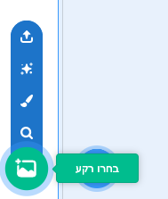
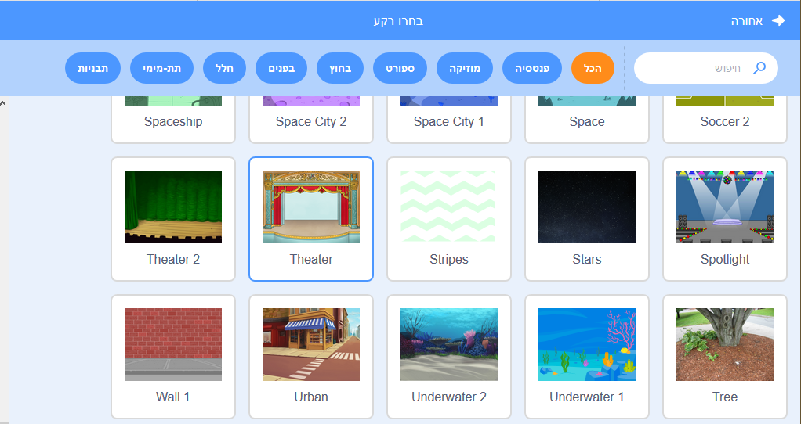

## הבמה

** הבמה ** הוא השטח בצד ימין, והוא המקום שבו הפרויקט שלך מתעורר לחיים. חשוב על זה כאזור ההתרחשות, בדיוק כמו במה אמיתית!

\--- task \--- כרגע, הבמה לבנה ונראית די משעממת! הוספו רקע צבעוני על ידי לחיצה על ** בחר רקע **.

 \--- /task \---

\--- משימה \--- לחץ על ** Indoors** ברשימה בראש. לאחר מכן לחץ על רקע תיאטרון.

 \--- /task \---

\--- task \--- הבמה שלך אמורה להיות דומה לזו:

 \--- /task \---