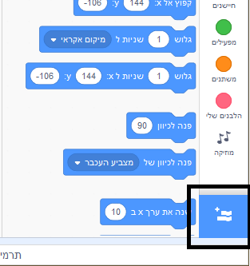
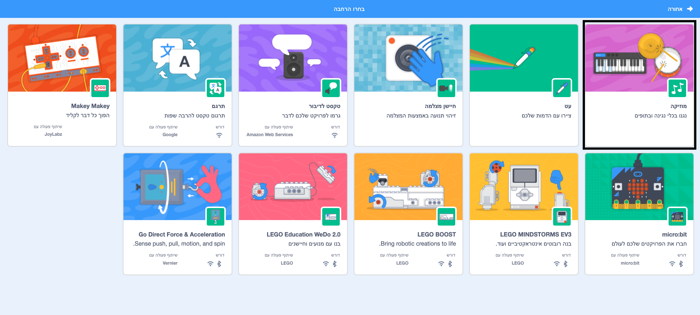

## יצירת תוף

עכשיו תוסיף קוד לתוף שלך, כך שישמיע צליל כאשר הוא נלחץ.

ניתן למצוא את בלוקי הקוד בכרטיסיית הסקריפטים, והם כולם מסודרים לפי צבעים!

\--- task \---

תחילה הוסף את הרחבת ה** מוסיקה ** כדי שתוכל לנגן בכלים השונים.

לחץ על כפתור ** הוסף הרחבה ** בפינה הימנית התחתונה.



לחץ על הרחבת ** מוסיקה ** כדי להוסיף אותה.



\--- /task \---

\--- task \---

Click on the drum sprite, and then drag these two blocks into the code area on the right:

```blocks3
when this sprite clicked play drum (\(1\) Snare Drum v) for (0.25) beats
```

\--- no-print \---


\--- /no-print \---

Make sure that the blocks are connected together (like LEGO bricks).

\--- /task \---

\--- task \---

Click on the drum to try out your new instrument!

\--- /task \---