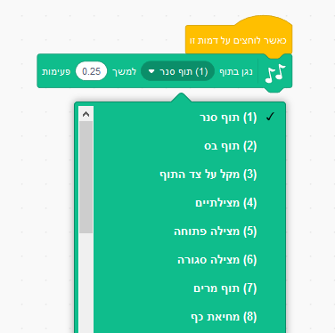
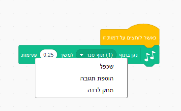

## האתגר: שפר את התוף שלך

האם תוכל לשנות את הצליל שהתוף עושה כאשר מקליקים עליו?



האם אתה יכול גם לגרום לתוף להשמיע צליל כאשר כפתור הרווח נלחץ? יהיה עליך להשתמש ב `ארוע` זה {:class="block3events"} block:

```blocks3
when [space v] key pressed
```

אם ברצונך להעתיק את הקוד ההנוכחי שלך, לחץ עליו באמצעות לחצן העכבר הימני ולאחר מכן לחץ על ** שכפל **.

