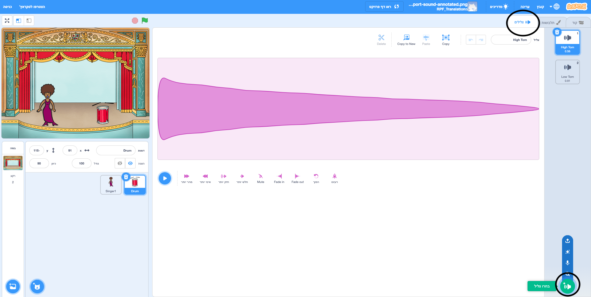
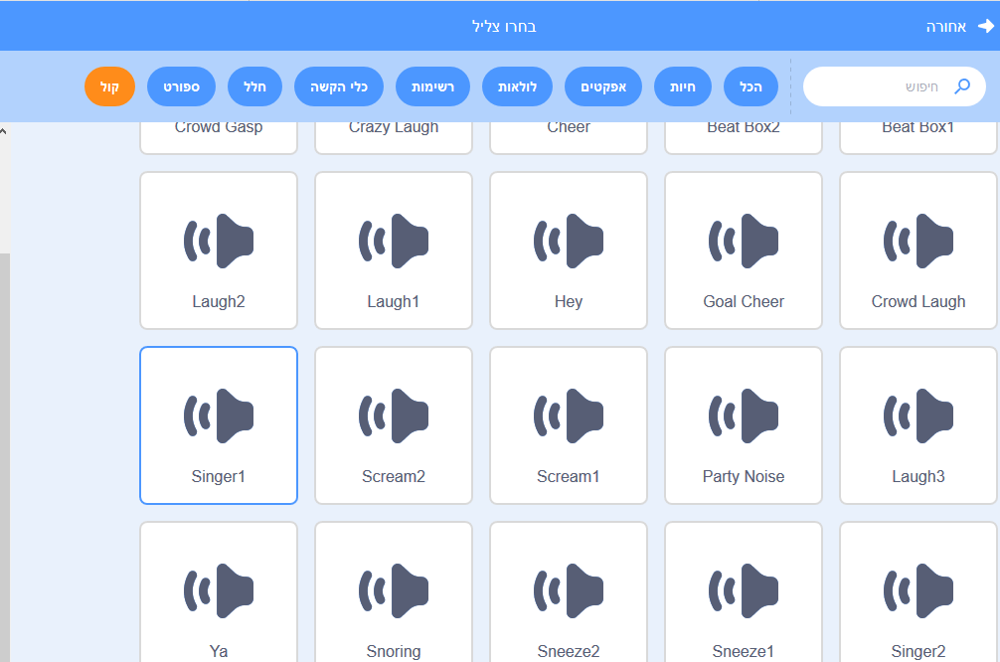

## יצירת זמרת

עכשיו תוסיף זמרת ללהקה שלך!

\--- task \---

הוסיף דמות זמרת לבמה שלך.


[[[generic-scratch3-sprite-from-library]]]

\--- /task \---

\--- task \---

לפני שתוכל לגרום לזמרת לשיר, אתה צריך להוסיף קול לזמרת. ודא כי בחרת את דמות הזמרת שלך, ולאחר מכן לחץ על הכרטיסיית הצלילים, ולחץ על ** בחר צליל **:



\--- /task \---

\--- task \---

Click on **Voice** in the list at the top, and then choose a sound to add to your sprite.



\--- /task \---

\--- task \---

To use the sound, add the following code blocks to your singer sprite:

```blocks3
when this sprite clicked play sound (singer1 v) until done
```

\--- /task \---

\--- task \---

Click on your singer on the stage and see what happens. Does she sing?

\--- /task \---