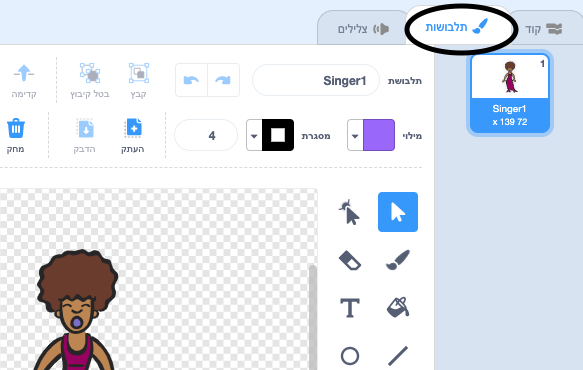
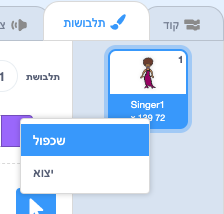
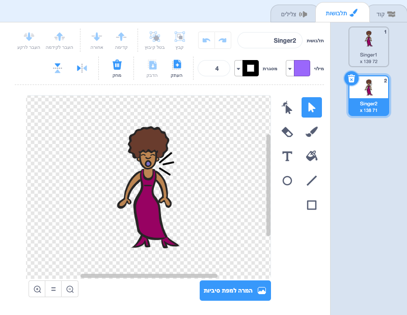
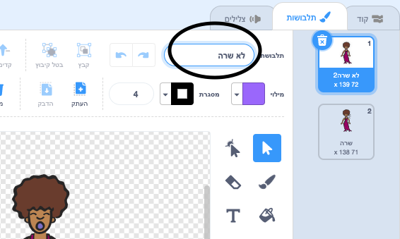

## תילבושות

עכשיו תגרום לזמרת שלך להראות כאילו היא שרה!

\--- משימה \--- אתה יכול לשנות את האופן שבו דמות הזמרת שלך תראה כאשר לוחצים עליה על ידי יצירת תלבושת חדשה. לחץ על הכרטיסייה תלבושות, ואתה תראה את התלבושת זמרת.

 \--- /task \---

\--- task \--- לחץ לחיצה ימנית על התלבושת ולאחר מכן לחץ על ** שכפל ** כדי ליצור עותק שלה.

 \--- /task \---

\--- task \--- לחץ על התחפושת החדשה (הנקראת "Singer2"), ולאחר מכן בחר באפשרות ה"קו" כדי לצייר קווים, כדי שייראה כאילו הזמרת שלך משמיעת קולות.

 \--- /task \---

\--- task \--- שמות התלבושות אינן מועילים מאוד כרגע. הקלד לתוך תיבות הטקסט של התלבושות כדי לשנות את השמות שלהם ל 'לא שרה' ו 'שרה'.

 \--- /task \---

\--- task \--- עכשיו שיש לך שתי תלבושות שונות עבור הזמרת שלך, אתה יכול לבחור איזו תלבושת מוצגת! הוסף את שני הבלוקים של הקוד לדמות הזמרת:

```blocks3
when this sprite clicked +switch costume to (singing v) play sound (singer1 v) until done +switch costume to (not singing v)
```

בלוק הקוד לשינוי התלבושת נמצא ב ` מראה ` {: class = "block3looks"}. \--- /task \---

\--- task \--- לחץ על הזמרת שלך על הבמה וראה מה קורה. היא נראית שרה? \--- /task \---

\--- task \--- עכשיו עשה שהתוף שלך יראה כאילו הקישו עליו!


- העזר בהוראות לשינוי תלבושת הזמרת שלך.

זכור לבדוק אם הקוד החדש שלך עובד! \--- /task \---