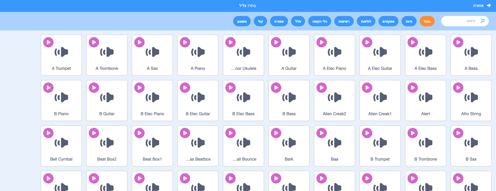
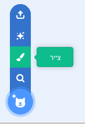
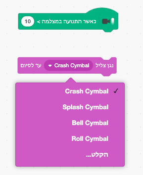

## האתגר: שפר את הלהקה שלך

השתמש במה שלמדת בפרויקט זה כדי ליצור את הלהקה שלך! אתה יכול ליצור כל כלי נגינה שתרצה - הסתכל בדמויות כלי הנגינה הזמינים והצלילים הזמינים כדי לקבל כמה רעיונות.



```blocks3
when this sprite clicked set instrument to (\(1\) Piano v) play note (60) for (0.25) beats
```

כלי הנגינה שלך לא חייב להיות מציאותי. לדוגמה, אתה יכול לעשות פסנתר עשוי מעוגיות!


אתה יכול להשתמש בדמויות נוספות מהספרייה, ואתה יכול אפילו לצייר דמויות משלך!



## \--- collapse \---

## title: מדוע הדמות שלי "קופצת" כאשר משנים תלבושת?

בעת יצירת דמות משלך, אתה עשוי לגלות כי כאשר אתה לוחץ על דמות, היא "קופצת" כאשר התלבושת משתנה. זאת משום ששתי התלבושות אינן ממורכזות באותה נקודה.

כדי לתקן זאת, ודא כי המרכזים של התלבושות של דמות שלך נמצאים באותה נקודה.

\--- /collapse \---

אם יש לך מיקרופון, אתה יכול להקליט צלילים משלך, ואתה יכול אפילו להשתמש במצלמת האינטרנט כדי לנגן בכלי הנגינה שלך!

