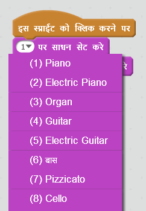
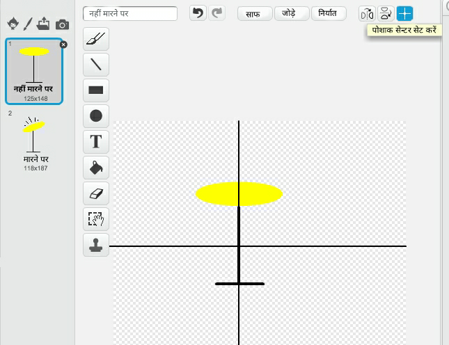

--- challenge ---

## चुनौती: अपना स्वयं का बैंड बनाएँ

अपना स्वयं का बैंड बनाने के लिए, इस प्रोजेक्ट में प्राप्त ज्ञान का उपयोग करें! आप अपनी पसंद का कोई भी उपकरण बना सकते हैं — कुछ नए विचार पाने के लिए उपलब्ध ध्वनियां और उपकरण देखें।

हालाँकि, आपके उपकरण का समझदार होना आवश्यक नहीं है। उदाहरण के लिए, आप मफिन्स से पियानो बना सकते हैं!

मौजूदा स्प्राइट्स के उपयोग के साथ-साथ, आप अपना स्प्राइट भी बना सकते हैं।

--- collapse ---
---
title: क्यों मेरा स्प्राइट पोशाक बदलने पर 'उछलता' है?
---

+ अपना स्वयं का स्प्राइट बनाते समय, आप यह देख सकते हैं कि जब आप स्प्राइट पर क्लिक करते हैं, तो यह पोशाक बदलने पर 'उछलता' है। ऐसा इसलिए है, क्योंकि दो पोशाकें एक ही स्थान पर केंद्रित नहीं होती।

इसे ठीक करने के लिए, दोनों पोशाकों पर **Set costume center** पर क्लिक करें, और यह सुनिश्चित करें कि दोनों पोशाके के केंद्र एक ही बिंदु पर हो।

--- /collapse ---

यदि आपके पास माइक्रोफोन है, तो आप अपने उपकरणों को छूने पर आवाज़ निकलने के लिए अपनी स्वयं की आवाज़े रिकॉर्ड कर सकते हैं, या वेबकैम का भी उपयोग कर सकते हैं!

--- /challenge ---