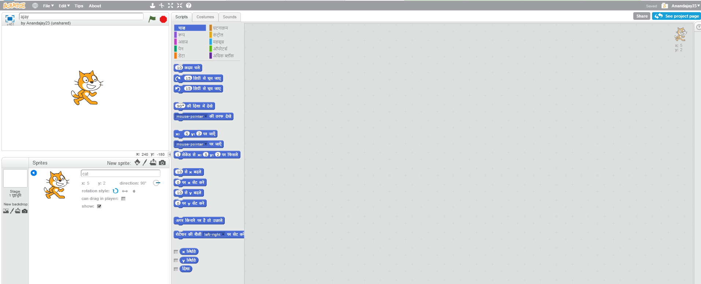
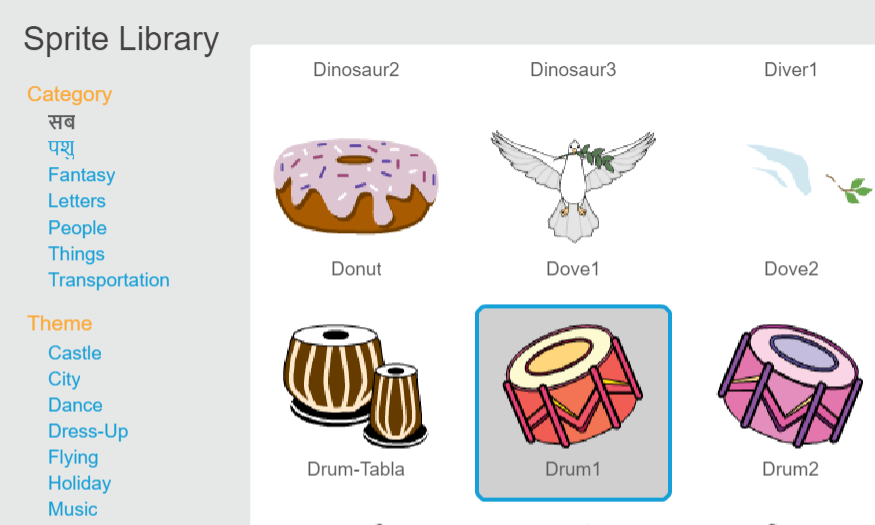

## स्प्राइट्स

इससे पहले कि आप कोडिंग शुरू करें, आपको कोड में 'चीज़ों' को जोड़ना होगा। Scratch में, इन 'चीज़ों' को **स्प्राइट्स** कहा जाता है।

\--- task \---

एक नया Scratch प्रोजेक्ट खोलिये।

**ऑनलाइन:** [rpf.io/scratch-new](http://rpf.io/scratch-new){:target="_blank"} पर एक नया ऑनलाइन Scratch प्रोजेक्ट खोलें।

**ऑफ़लाइन:** ऑफ़लाइन एडिटर में एक नया प्रोजेक्ट खोलें।

यदि आपको Scratch ऑफ़लाइन एडिटर को डाउनलोड और इंस्टॉल करने की आवश्यकता है, तो आप इसे [rpf.io/scratchoff](http://rpf.io/scratchoff){:target="_blank"} पर पा सकते हैं।

यह इस तरह दिखता है:

\--- /task \---

\--- task \---

बिल्ली जो आप देख सकते है, वह है Scratch शुभंकर। आपको इस गेम के लिए इसकी आवश्यकता नहीं है, इसलिए इसे X पर क्लिक करके हटा दें।

\--- /task \---

\--- task \---

अगला, सभी Scratch स्प्राइट की सूची खोलने के लिए लाइब्रेरी **Choose sprite from library** पर क्लिक करें।

\--- /task \---

\--- task \---

एक ड्रम स्प्राइट देखने तक नीचे स्क्रॉल करें। इसे अपने प्रोजेक्ट में जोड़ने के लिए ड्रम पर क्लिक करें।

\--- /task \---

\--- task \---

If you are signed in to your Scratch account, type the title of your project into the project title box at the top of the screen:

**Tip:** Give your projects helpful names so that you can easily find them when you have lots of projects.

Next, click on File, and then on Save now to save your project.

If you are not online or don't have a Scratch account, you can save a copy of your project by clicking on **Save to your computer** instead.

\--- /task \---