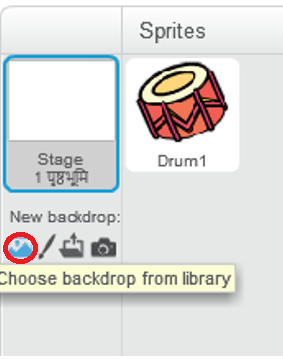
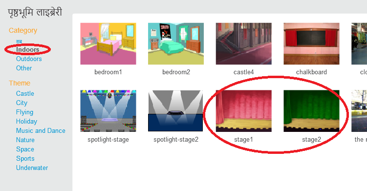

## स्टेज

**Stage** (चरण) दाईं ओर का क्षेत्र है, और वह जगह है जहाँ आपका प्रोजेक्ट आता है। इसे एक वास्तविक मंच की तरह, एक प्रदर्शन क्षेत्र के रूप में सोचें!

\--- task \---

इस समय, मंच सफेद है और बहुत उबाऊ लग रहा है! **Choose a backdrop** पर क्लिक करें और बैकड्रॉप चुनें।

\--- /task \---

\--- task \---

शीर्ष पर सूची में **Indoors** पर क्लिक करें। फिर थिएटर बैकड्रॉप (theatre backdrop) पर क्लिक करें।

\--- /task \---

\--- task \---

क्लिक करें और ड्रम को स्टेज के नीचे तक खिसकाएं।

\--- /task \---

\--- task \---

आपका स्टेज अब इस तरह दिखना चाहिए:

\--- /task \---