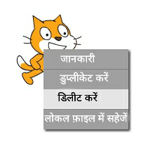
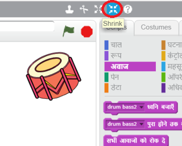

## स्प्राइट्स

इससे पहले कि आप कोडिंग आरंभ कर सकें, आपको कोड में 'चीज़' को जोड़ना होगा। Scratch में, इन 'चीज़' को __स्प्राइट्स__ कहा जाता है।

+ पहले, Scratch एडिटर खोलें। आप <a href="http://jumpto.cc/scratch-new" target="_blank">jumpto.cc/scratch-new</a> पर ऑनलाइन Scratch एडिटर खोज सकते हैं। यह इसके जैसा दिखता है:

	

+ कैट स्प्राइट जिसे आप देख सकते हैं, Scratch मस्कट होता है। चलिए इस पर राइट क्लिक करके और फिर **delete** (हटाएँ) पर क्लिक करके इससे छुटकारा पाएँ।

	

+ इसके बाद, सभी Scratch स्प्राइट्स की सूची खोलने के लिए **Choose sprite from library** (लाइब्रेरी से स्प्राइट चुनें) पर क्लिक करें।

	

+ तब तक नीचे स्क्रॉल करें, जब तक आपको ड्रम स्प्राइट न दिखाई दे। ड्रम को अपने प्रोजेक्ट में जोड़ने के लिए, इस पर क्लिक करें, और **OK** (ठीक) पर क्लिक करें।

	

+ **shrink** (सिकुड़ना) आइकन पर क्लिक करें, और फिर ड्रम को छोटा करने के लिए इस पर कुछ बार क्लिक करें।

	

शीर्ष बाएँ कोने में टेक्स्ट बॉक्स में टाइप करके अपने प्रोजेक्ट को नाम दें।

आप अपने प्रोजेक्ट को सहेजने के लिए **File** (फाइल) और फिर **Save now** (अभी सहेजें) पर क्लिक कर सकते हैं। यदि आपके पास Scratch खाता नहीं है, तो आप **Download to your computer** (अपन कंप्यूटर पर डाउनलोड करें) पर क्लिक करके अपने प्रोकेक्ट की प्रतिलिपि को सहेज सकते हैं।

