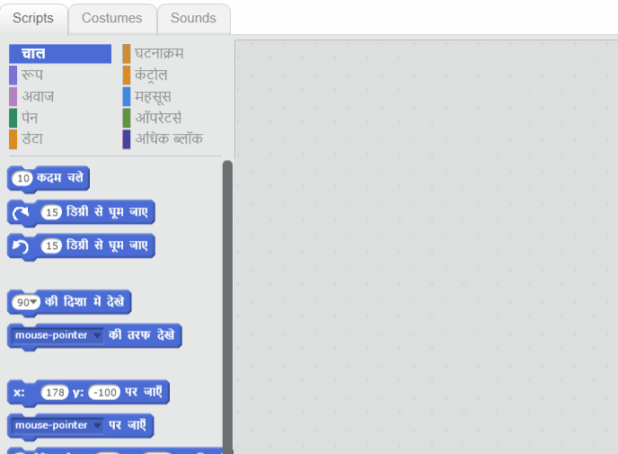

## ड्रम बनाना

अब आप अपने ड्रम में कोड जोड़ेंगे ताकि क्लिक करने पर ड्रम एक आवाज़ करे।

आप Scripts टैब में कोड ब्लॉक खोज सकते हैं, और वे सभी कोड रंगीन होते हैं!

\--- task \---

पहले **Music** एक्सटेंशन जोड़ें ताकि आप वाद्ययंत्र बजा सकें।

नीचे बाएँ हाथ के कोने में **Add extension** (एड एक्सटेंशन) बटन पर क्लिक करें।


इसे जोड़ने के लिए **Music** एक्सटेंशन पर क्लिक करें।


\--- /task \---

\--- task \---

ड्रम स्प्राइट पर क्लिक करें, और फिर इन दो ब्लॉकों को दाईं ओर कोड क्षेत्र में खींचें:

```blocks3
when this sprite clicked
play drum (\(1\) Snare Drum v) for (0.25) beats
```

\--- no-print \---



\--- /no-print \---

यह सुनिक्षित कीजिये की सारे ब्लॉक जुड़े हुए हैं (LEGO के तरह)।

\--- /task \---

\--- task \---

ड्रम पर क्लिक करे ताकि आप अपने नए यंत्र को बजा सकते हैं!

\--- /task \---