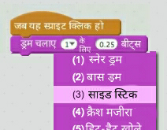
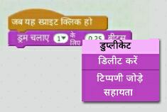

## चुनौती: अपने ड्रम में सुधार करना

क्या आप क्लिक किए जाने पर ड्रम द्वारा बजाई जाने वाली ध्वनि को बदल सकते हैं?



क्या स्पेस बार दबाने पर साउंड (sound) बनाने के लिए ड्रम भी मिल सकता है? आपको इस `event`{:class="block3events"} ब्लॉक का उपयोग करने की आवश्यकता होगी:

```blocks3
when [space v] key pressed
```

यदि आप अपने मौजूदा कोड को कॉपी करना चाहते हैं, तो उस पर राइट-क्लिक करें और फिर **duplicate** पर क्लिक करें।

