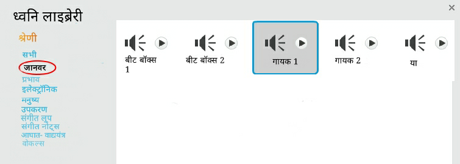

## गायक बनाना

अब आप अपने बैंड में एक गायक जोड़ेंगे!

--- task ---

अपने स्टेज पर एक गायक स्प्राइट जोड़ें।


[[[generic-scratch3-sprite-from-library]]]

--- /task ---

--- task ---

इससे पहले कि आप अपने गायक को गा सकते हैं, आपको अपने गायक स्प्राइट में एक ध्वनि जोड़ने की आवश्यकता है। सुनिश्चित करें कि आपने अपने गायक स्प्राइट का चयन किया है, फिर ध्वनि टैब पर क्लिक करें, और **पर क्लिक करें एक ध्वनि चुनें**


--- /task ---

--- task ---

शीर्ष पर सूची में **आवाज** पर क्लिक करें, और फिर अपने स्प्राइट में जोड़ने के लिए एक ध्वनि चुनें।



--- /task ---

--- task ---

ध्वनि का उपयोग करने के लिए, निम्नलिखित कोड को अपने गायक स्प्राइट में जोड़ें:

```blocks3
when this sprite clicked
play sound (singer1 v) until done
```

--- /task ---

--- task ---

मंच पर अपने गायक पर क्लिक करें और देखें कि क्या होता है। क्या वह गाती है?

--- /task ---