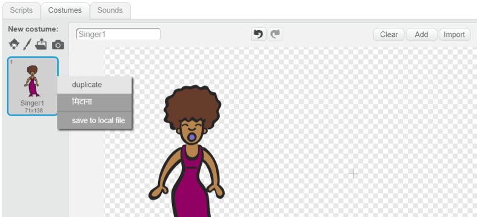

## पोशाकें

अब आप अपने गायक को ऐसा बना देंगे जैसे वह गा रहा हो!

--- task ---

आप बदल सकते हैं कि आपका गायक कैसा दिखता है जब वह एक नई पोशाक बनाकर क्लिक करता है। कॉस्टयूम टैब पर क्लिक करें, और आप गायक कॉस्ट्यूम देखेंगे।


--- /task ---

--- task ---

पोशाक पर राइट-क्लिक करें और फिर इसकी एक प्रति बनाने के लिए **डुप्लिकेट (duplicate)** पर क्लिक करें।



--- /task ---

--- task ---

नई पोशाक पर क्लिक करें (जिसे 'सिंगर 2') कहा जाता है), और फिर लाइन टूल का चयन करें और लाइनों को ड्रा करें ताकि ऐसा लगे कि आपका गायक आवाज कर रहा है।


--- /task ---

--- task ---

वेशभूषा के नाम फिलहाल बहुत मददगार नहीं हैं। अपने नाम को 'गायन नहीं' और 'गायन' में बदलने के लिए वेशभूषा के टेक्स्ट बॉक्स में टाइप करें।


--- /task ---

--- task ---

अब जब आपके पास अपने गायक के लिए दो अलग-अलग वेशभूषा है, तो आप चुन सकते हैं कि कौन सी पोशाक प्रदर्शित की गई है! इन दो कोड ब्लॉक को अपने गायक स्प्राइट में जोड़ें:

```blocks3
when this sprite clicked
+switch costume to (singing v)
play sound (singer1 v) until done
+switch costume to (not singing v)
```

पोशाक बदलने के लिए कोड ब्लॉक `Looks (लुक्स)`{:class="block3looks"} अनुभाग में है।

--- /task ---

--- task ---

मंच पर अपने गायक पर क्लिक करें। क्या वह ऐसी दिखती है जैसे वह गा रही हो?

--- /task ---

--- task ---

अब अपने ड्रम देखो जैसे यह हिट हो रहा है!


- आपकी मदद करने के लिए अपने गायक स्प्राइट की पोशाक को बदलने के निर्देशों का उपयोग करें।

अपने नए कोड के काम की जाँच करना याद रखें।

--- /task ---