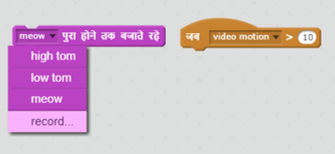

## चुनौती: अपने बैंड में सुधार करें 

अपने स्वयं के बैंड बनाने के लिए इस परियोजना में आपने जो सीखा है उसका उपयोग करें! आप अपनी पसंद के किसी भी उपकरण को बना सकते हैं - कुछ विचारों को प्राप्त करने के लिए उपलब्ध यंत्र स्प्राइट और ध्वनियों को देखें।


```blocks3
when this sprite clicked
set instrument to (\(1\) Piano v)
play note (60) for (0.25) beats
```

आपके उपकरणों को यथार्थवादी होना जरूरी नहीं है। उदाहरण के लिए, आप मफ़िन से बना एक पियानो (piano) बना सकते हैं!


आप library से अधिक स्प्राइट्स का उपयोग कर सकते हैं, और आप अपने स्वयं के स्प्राइट्स भी पेंट कर सकते हैं!


## \--- collapse \---

## title: क्यों मेरा स्प्राइट पोशाक बदलने पर 'उछलता' है?

अपना स्वयं का स्प्राइट बनाते समय, आप यह देख सकते हैं कि जब आप स्प्राइट पर क्लिक करते हैं, तो यह पोशाक बदलने पर 'उछलता' है। ऐसा इसलिए है, क्योंकि दो पोशाकें एक ही स्थान पर केंद्रित नहीं होती।

इसे ठीक करने के लिए, सुनिश्चित करें कि आपके स्प्राइट की वेशभूषा के केंद्र समान हैं।

\--- /collapse \---

यदि आपके पास एक माइक्रोफोन है, तो आप अपनी खुद की आवाज़ रिकॉर्ड कर सकते हैं, और आप अपने उपकरणों को हिट करने के लिए एक वेब कैमरा का उपयोग भी कर सकते हैं!

