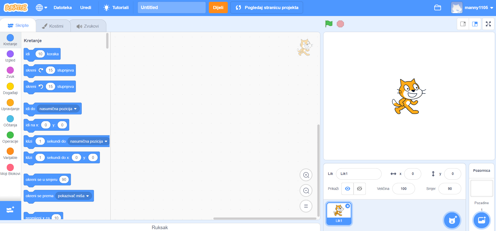
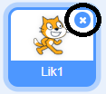
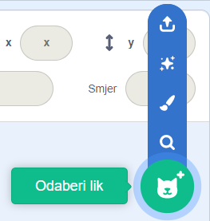
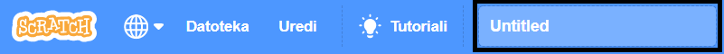
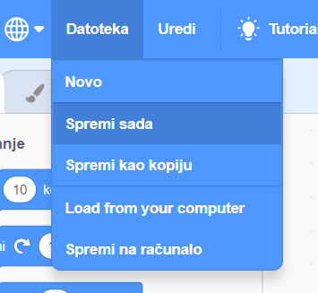

## Likovi

Prije nego li započneš s kodiranjem, moraš dodati nekakvu 'stvar' koju ćeš isprogramirati. U Scratchu se ove 'stvari' zovu **likovi**.

\--- task \--- Otvori novi Scratch projekt.

**Online:** otvori novi Scratch projekt s [rpf.io/scratch-new](http://rpf.io/scratch-new){:target="_blank"}.

**Offline:** otvori novi projekt u offline uređivaču.

Ako trebaš preuzeti i instalirati offline Scratch uređivač, to možeš napraviti na [rpf.io/scratchoff](http://rpf.io/scratchoff){:target="_blank"}.

It looks like this:

 \--- /task \--- \--- task \--- The cat sprite that you can see is the Scratch mascot. You don't need it for this game, so get rid of it by right-clicking it and then clicking on **delete**.

 \--- /task \---

\--- task \--- Next, click on **Choose sprite from library** to open up a list of all the Scratch sprites.

 \--- /task \---

\--- task \--- Scroll down until you see a drum sprite. Click on a drum to add it to your project.

\--- /task \---

\--- task \---

Click and drag the drum to the bottom of the Stage.

\--- /task \---

\--- task \--- Give your program a name by typing into the text box at the top.

Then click on **File**, and then on **Save now** to save your project.

If you are not online or don't have a Scratch account, you can save a copy of your project by clicking on **Save to your computer** instead.

 \--- /task \---