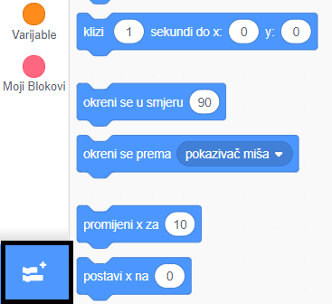
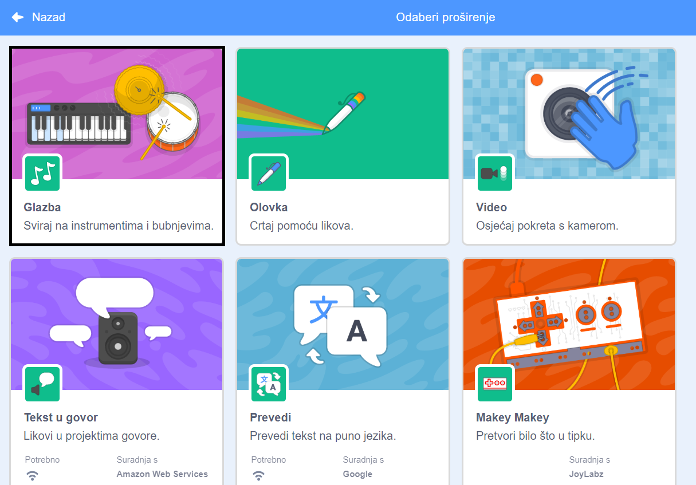
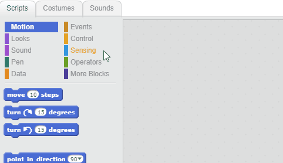

## Napravi bubanj

Sada ćeš napisati kôd kako bi bubanj pravio zvuk kad na njega klikneš.

Blokove kôda možeš pronaći na kartici Skripte i svi su označeni bojama!

\--- task \---

Prvo dodaj proširenje **Glazba** kako bi instrumenti svirali.

Klikni na gumb **Dodaj proširenje** u donjem lijevom kutu.



Klikni na proširenje **Glazba**.



\--- /task \---

\--- task \---

Click on the drum sprite, and then drag these two blocks into the code area on the right:

```blocks3
Kada je lik kliknut
bubnjaj ((1) Mali bubanj v) (0.25) puta
```

\--- no-print \---



\--- /no-print \---

Make sure that the blocks are connected together (like LEGO bricks).

\--- /task \---

\--- task \---

Click on the drum to try out your new instrument!

\--- /task \---