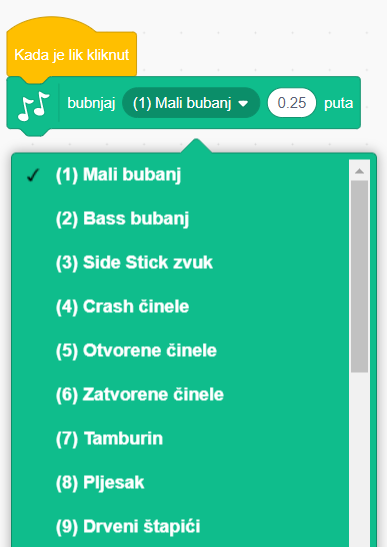
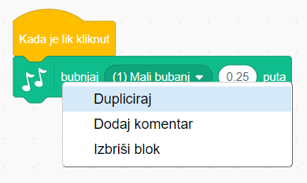

## Izazov: poboljšaj svoj bubanj

Možeš li promijeniti zvuk koji bubanj čini kad se na njega klikne?



Možeš li namjestiti da bubanj stvara zvuk i kad se pritisne tipka za razmak? Trebat će ti ovaj blok iz grupe `Događaji`{:class="block3events"}:

```blocks3
kada je tipka [razmaknica v] pritisnuta
```

Ako želiš kopirati postojeći kôd, klikni na njega desnom tipkom miša i zatim na **Dupliciraj**.

