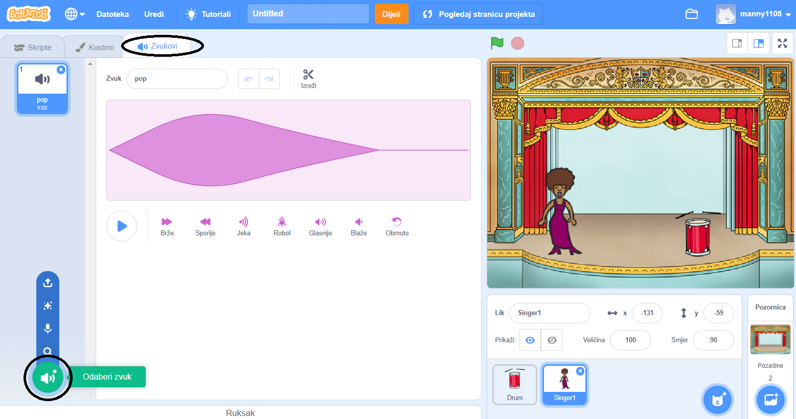
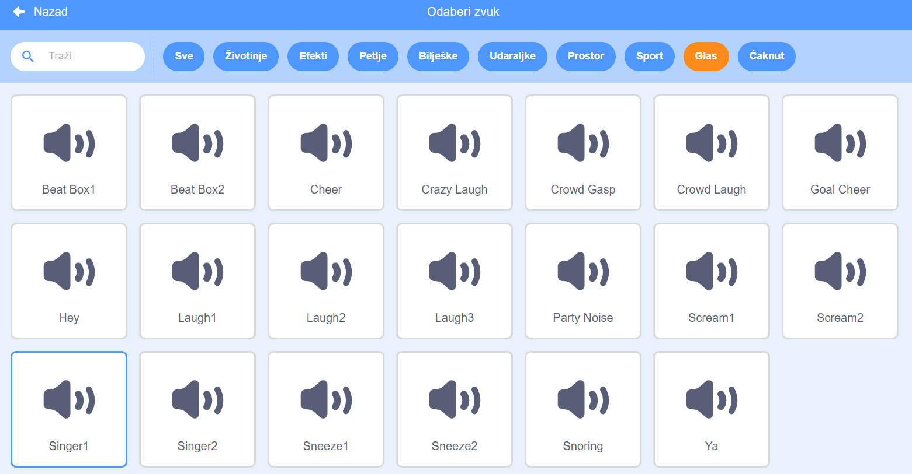

## Dodaj pjevačicu

Sada ćeš dodati pjevačicu svom bendu!

\--- task \---

Dodaj lik pjevačice na svoju Pozornicu.


[[[generic-scratch3-sprite-from-library]]]

\--- /task \---

\--- task \---

Prije nego omogućiš svojoj pjevačici da pjeva, moraš joj dodati zvuk. Klikni na lik pjevačice, zatim na karticu Zvukovi, a onda na **Odaberi zvuk**:

 \--- /task \---

\--- task \--- Klikni na **Glas** u popisu kategorija pri vrhu, a zatim odaberi zvuk koji želiš dodati liku.

 \--- /task \---

\--- task \--- Da bi se zvuk upotrijebio, moraš dodati sljedeće blokove kôda liku pjevačice:

```blocks3
Kada je lik kliknut
sviraj zvuk (singer1 v) do kraja
```

\--- /task \---

\--- task \--- Klikni na pjevačicu na pozornici i prati što će se dogoditi. Pjeva li? \--- /task \---