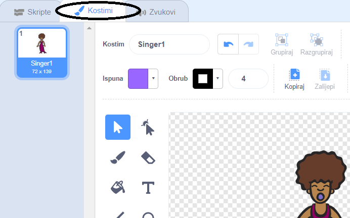
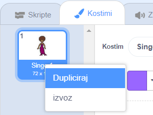
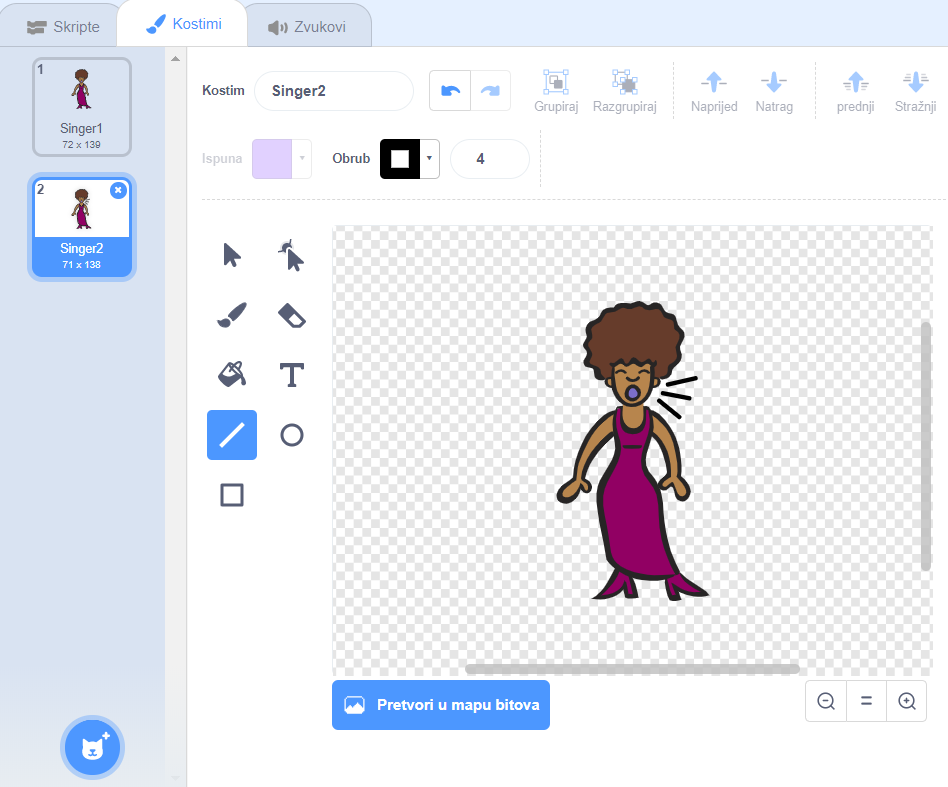
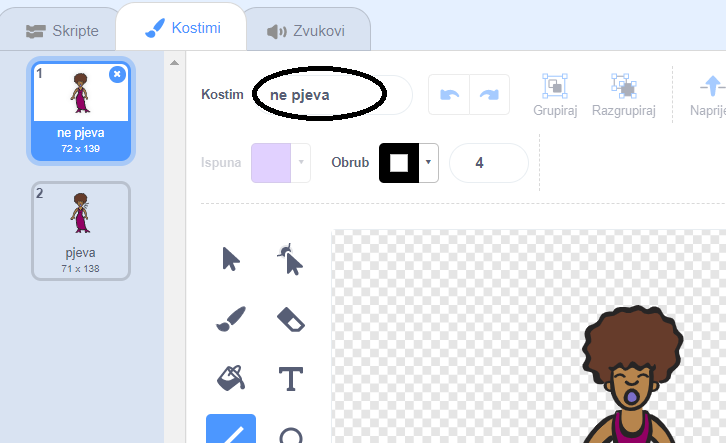

## Kostimi

Sada ćeš učiniti da tvoja pjevačica izgleda kao da pjeva!

\--- zadatak \--- Možeš napraviti novi kostim i tako promijeniti kako tvoja pjevačica izgleda kad se na nju klikne. Klikni na karticu Kostimi i vidjet ćeš kostim pjevačice.

 \--- /task \---

\--- task \--- Desnom tipkom miša klikni na kostim lika, a zatim na **Dupliciraj** da napraviš kopiju kostima.

 \--- /task \---

\--- task \--- Klikni na novi kostim („Singer2”), a zatim odaberi alat za crtanje linija i nacrtaj linije tako da izgleda kao da pjevačica stvara zvuk.

 \--- /task \---

\--- task \--- Nazivi kostima trenutno nisu od velike pomoći - daj im nova imena! U tekstni okvir kostima upiši „pjeva” i „ne pjeva”.

 \--- /task \---

\--- task \--- Sad kad imaš dva različita kostima, možeš birati u kojem će kostimu tvpja pjevačica biti prikazana! Dodaj ova dva bloka kôda liku pjevačice:

```blocks3
Kada je lik kliknut
+promijeni kostim u (pjeva v)
sviraj zvuk (Pjevačica1 v) do kraja
+promijeni kostim u (ne pjeva v)
```

Blok kôda za promjenu kostima nalazi se u kategoriji `Izgled`{:class="block3looks"}. \--- /task \---

\--- task \--- Klikni na pjevačicu na pozornici. Izgleda li kao da pjeva? \--- /task \---

\--- task \--- Sada napravi da izgleda kao da netko udara po tvom bubnju!


- Iskoristi upute za promjenu kostima pjevačice.

Ne zaboravi provjeriti radi li tvoj novi kôd! \--- /task \---