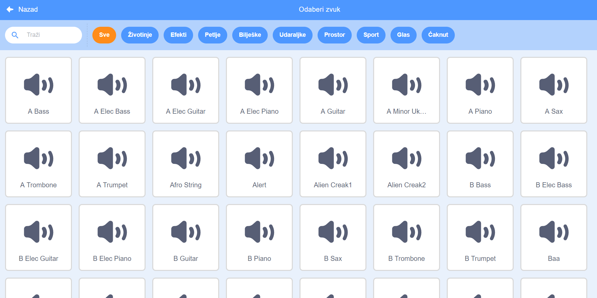
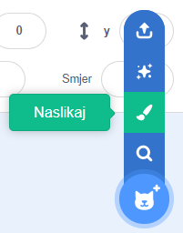
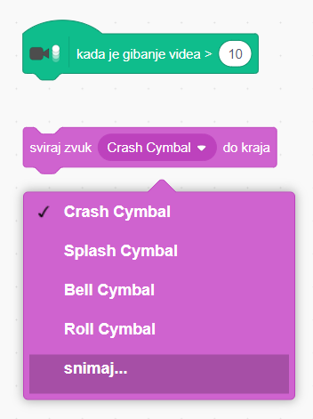

## Izazov: poboljšaj svoj bend

Upotrijebi naučeno i napravi svoj bend! Možeš napraviti koje god instrumente želiš - baci oko na dostupne instrumente i zvukove instrumenata. Možda dobiješ nekakvu ideju!



```blocks3
Kada je lik kliknut
postavi instrument na ((1) Piano v)
sviraj ton (60) (0.25) puta
```

Tvoji instrumenti ne moraju biti realistični. Možeš, na primjer, napraviti klavir od muffina!


Možeš iskoristiti još likova iz knjižnice, ali i nacrtati vlastite likove!



## \--- collapse \---

## title: Zašto moj lik "skače" kad mijenja kostim?

Prilikom stvaranja vlastitog lika, možda ćeš primijetiti da, kada klikneš na njega, on "skoči" kada mijenja kostim. To je zato što dva kostima nisu centrirana na istom mjestu.

Provjeri jesu li središta kostima tvojih likova ista kako se ovo ne bi događalo.

\--- /collapse \---

Ako imaš mikrofon, možeš snimiti vlastite zvukove i čak koristiti web kameru za udaranje po instrumentima!

