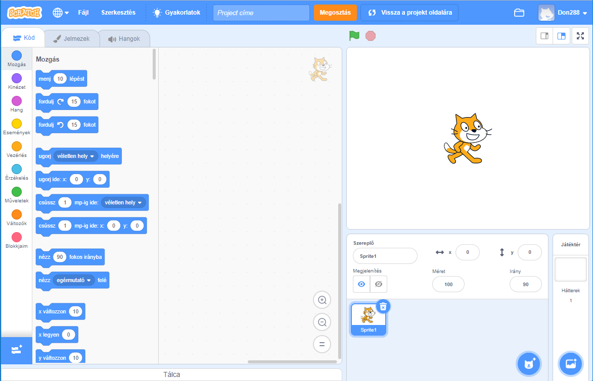
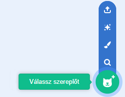
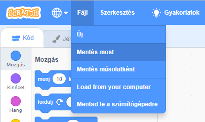

## Szereplők

Mielőtt elkezdenéd a kódolást, hozzá kell adnod egy 'dolgot' a kódhoz. A Scratch-ben ezeket a 'dolgokat' **szereplőknek** nevezik.

\--- task \--- Nyiss meg egy új Scratch projektet.

**Online:** nyiss megy egy új online Scratch projektet itt:[rpf.io/scratch-new](http://rpf.io/scratch-new){:target="_ blank"}.

**Offline:** nyiss egy új projektet az offline szerkesztőben.

Ha le szeretnéd tölteni és telepíteni a Scratch offline szerkesztőt, akkor azt itt találod: [rpf.io/scratchoff](http://rpf.io/scratchoff){:target="_blank"}.

Így néz ki:

 \--- /task \--- \--- task \--- A macska szereplő a Scratch kabalája. Ehhez a játékhoz rá nincs szükség - kattints rá a jobb egérgombbal, majd kattints a **törlés**-re.

 \--- /task \---

\--- task \--- Következő lépésként kattints a **Válassz szereplőt a könyvtárból** gombra, hogy megnyisd a listát az összes Scratch szereplőről.

 \--- /task \---

\--- task \--- Görgess le, amíg meg nem jelenik egy dob szereplő. Kattints a dobra a projekthez való hozzáadáshoz.

\--- /task \---

\--- task \---

Kattints a dobra és húzd a színpad aljára.

\--- /task \---

\--- task \--- Adj nevet a programodnak a felső soron található szövegdobozban.

Ezután kattints a **Fájl** menüpontra, majd a **Mentés most** gombra a projekt mentéséhez.

Ha nem vagy online vagy nincs Scratch fiókod, letöltheted a projektedet a **Mentsd le a számítógépedre** menüponttal.

 \--- /task \---