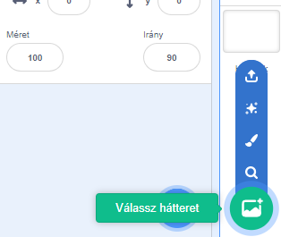
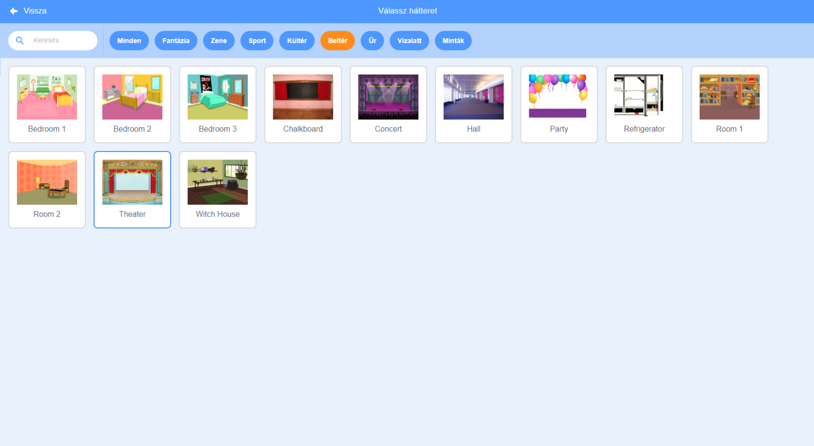

## A színpad

A **színpad** a jobb oldali terület, ahol a projekted életre kel. Gondolj rá úgy, mint egy előadó terület, akárcsak egy igazi színpad!

\--- task \--- Jelenleg a színpad fehér, és nagyon unalmasnak tűnik! Adj hozzá egy hátteret a **Válassz hátteret** gomb segítségével.

 \--- /task \---

\--- task \--- Kattints a lista tetején lévő **Beltér** gombra. Ezután válaszd ki a 'Theater' hátterret.

 \--- /task \---

\--- task \--- A színpadnak most hasonlóan kell kinéznie:

 \--- /task \---