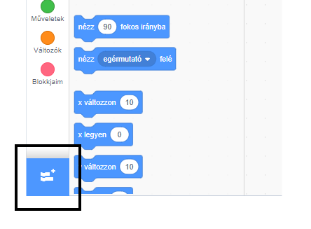
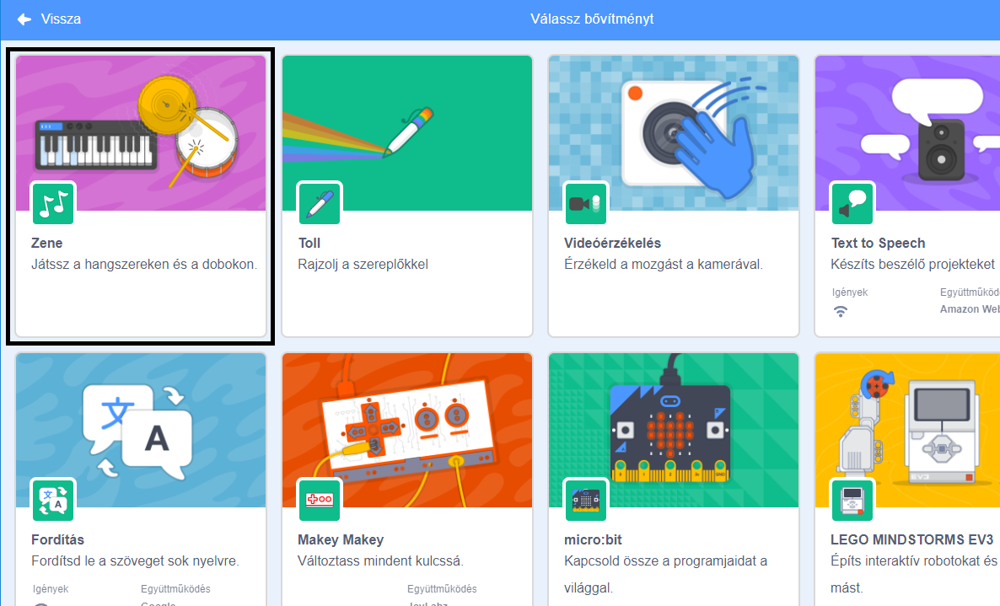
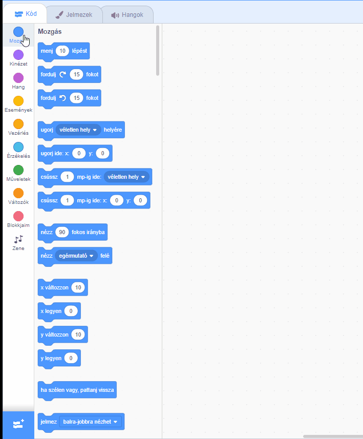

## Készíts egy dobot

Most hozzá fogsz adni egy kódot a dobhoz úgy, hogy kiadjon egy hangot amikor rákattintasz.

A kódblokkokat a Kód fülön találod meg és ezek mindegyike színkódolt!

\--- task \---

Először add hozzá a **Zene** bővítményt, hogy játszhass a hangszerekkel.

Kattints a **Bővítmény hozzáadása** gombra a bal alsó sarokban.



Kattints a **Zene** bővítményre a hozzáadáshoz.



\--- /task \---

\--- task \---

Click on the drum sprite, and then drag these two blocks into the code area on the right:

```blocks3
ezen szereplőre kattintáskor
játssz ((1) Pergődob v) dobon (0.25) ütemig
```

\--- no-print \---



\--- /no-print \---

Make sure that the blocks are connected together (like LEGO bricks).

\--- /task \---

\--- task \---

Click on the drum to try out your new instrument!

\--- /task \---