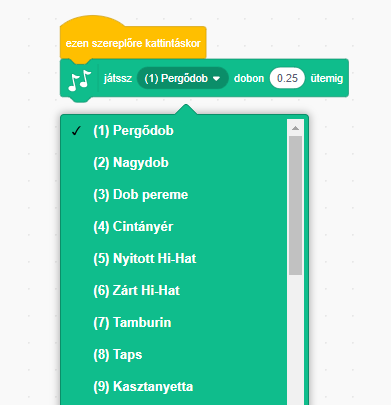
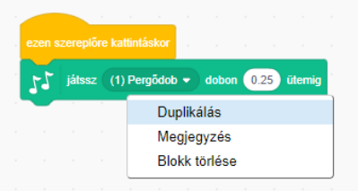

## Kihívás: fejleszd a dobot

Meg tudod változtatni a dob hangját, amikor rákattintasz?



Meg tudod csinálni, hogy a dob akkor adjon ki hangot, ha lenyomod a szóközt? Ezt a `esemény`{:class="block3events"} blokkot kell használnod:

```blocks3
amikor [space v] gomb lenyomva
```

Ha másolni szeretnéd a meglévő kódot, kattints rá jobb egérgombbal, majd kattints a **duplikálás**ra.

