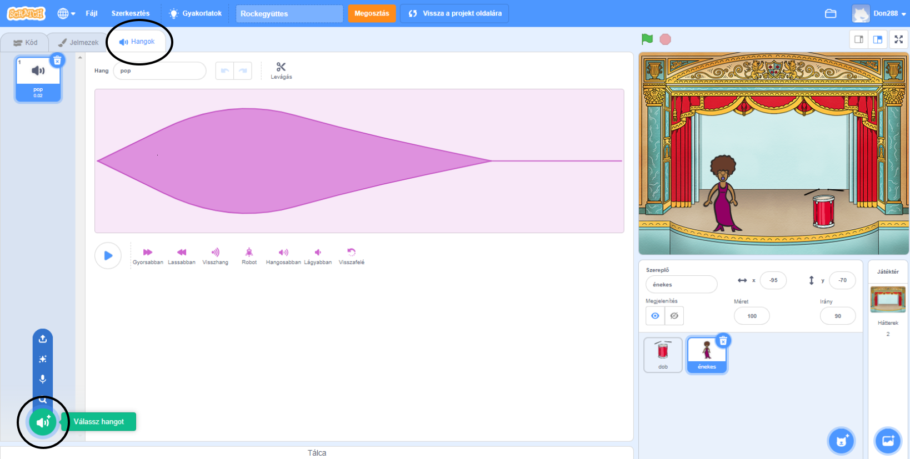
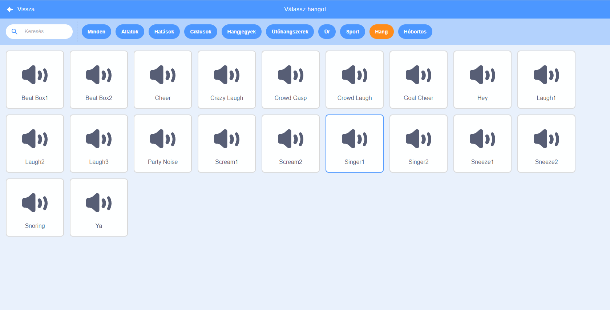

## Készíts egy énekest

Most adj hozzá egy énekest a zenekarodhoz!

\--- task \---

Add hozzá egy énekes szereplőt a színpadhoz.


[[[generic-scratch3-sprite-from-library]]]

\--- /task \---

\--- task \---

Mielőtt az énekesed énekelni tudna, hangot kell hozzáadnod az énekes szereplőhöz. Győződj meg róla, hogy kiválasztottad az énekes szereplőt, kattints a Hangok fülre, majd a **Válassz hangot** gombra:



\--- /task \---

\--- task \---

Click on **Voice** in the list at the top, and then choose a sound to add to your sprite.



\--- /task \---

\--- task \---

To use the sound, add the following code blocks to your singer sprite:

```blocks3
ezen szereplőre kattintáskor
játszd végig (singer1 v) hangot
```

\--- /task \---

\--- task \---

Click on your singer on the stage and see what happens. Does she sing?

\--- /task \---