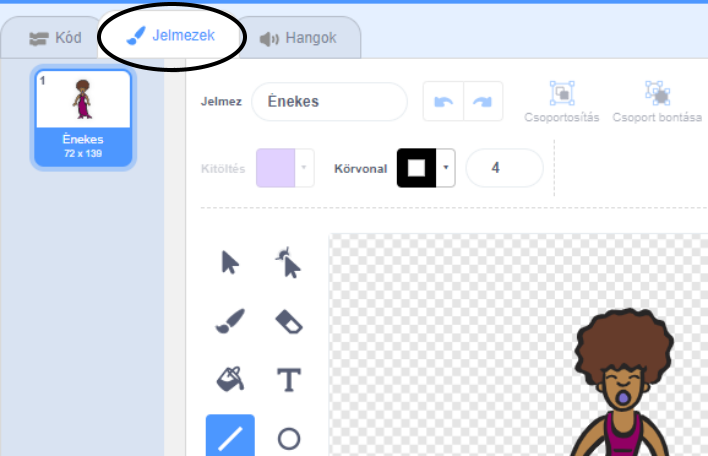
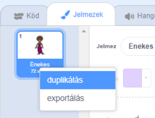
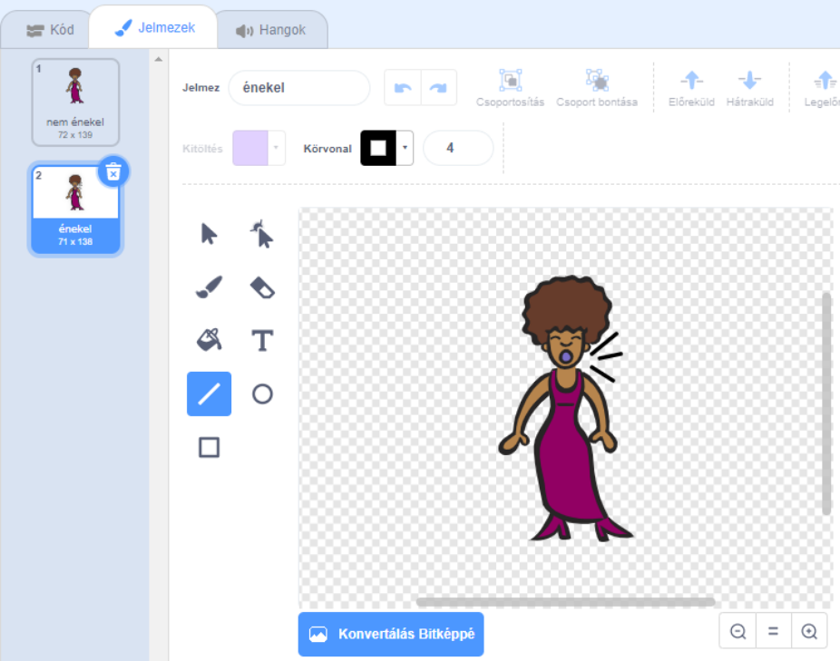
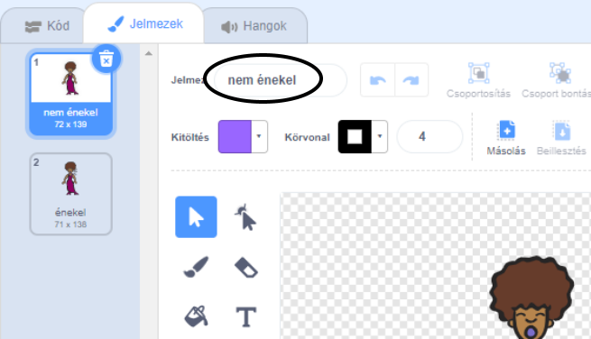

## Jelmezek

Most át fogod alakítani az énekesed úgy, mintha énekelne!

\--- task \--- Megváltoztathatod az énekes szereplő kinézetét, amikor rákattintasz egy új jelmez létrehozásával. Kattints a Jelmezek fülre, és láthatod az énekes jelmezt.

 \--- /task \---

\--- task \--- Kattints a jobb egérgombbal a jelmezre, majd a **duplikálás** gombra hogy létrehozz egy másolatot.

 \--- /task \---

\--- task \--- Kattints az új jelmezre (Singer2), majd válaszd ki a vonal eszközt és rajzolj vonalakat, hogy úgy tűnjön, mintha az énekes hangot adna ki.

 \--- /task \---

\--- task \--- A jelmezek nevei jelenleg nem túl átláthatóak. Írj a jelmezek szövegmezőibe, változtasd meg a neveiket 'nem énekel' és 'énekel'-re.

 \--- /task \---

\--- task \--- Most, hogy két különböző jelmeze van az énekesednek, kiválaszthatod, hogy melyik jelmez jelenjen meg! Add hozzá ezt a két kódblokkot az énekes szereplőhöz:

```blocks3
ezen szereplőre kattintáskor
jelmez legyen (énekel v)
játszd végig (singer1 v) hangot
jelmez legyen (nem énekel v)
```

A jelmez megváltoztatásához szükséges kódblokkot a `Kinézet`{:class="block3looks"} részen találod. \--- / task \---

\--- task \--- Kattints az énekesre a színpadon. Úgy néz ki, mintha énekelne? \--- / task\---

\--- task \--- Most alakítsd át a dobot, hogy úgy nézzen ki, mintha megütnék!


- Használd az énekes szereplő jelmezének megváltoztatásához szükséges utasításokat segítségként.

Ne felejtsd el tesztelni, hogy az új kódod működik-e! \--- / task \---