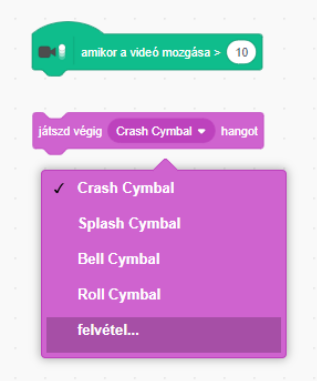

## Kihívás: fejleszd a zenekarod

Használd a projektben megtanultakat saját zenekarod megalapítására! Létrehozhatsz tetszőleges hangszereket - nézd meg a rendelkezésre álló hangszereket és hangokat ötletekért.


```blocks3
ezen szereplőre kattintáskor
hangszer legyen ((1) Zongora v)
játszd le (60) hangjegyet (0.25) ütemig
```

A hangszereidnek azonban nem kell reálisnak lenniük. Például, muffinokból készíthetsz egy zongorát!


Több szereplőt használhatsz a könyvtárból és akár saját szereplőt is készíthetsz!


## \--- collapse \---

## title: Miért ugrál a szereplő, amikor megváltozik a jelmez?

Mikor saját szereplőt hozol létre, előfordulhat, hogy ha rákattintasz a szereplőre, akkor az 'ugrik' jelmezváltoztatás közben. Ez azért történik, mert a két jelmez nem ugyanabban a pozícióban van.

Ennek megoldásához győződj meg arról, hogy a szereplőd jelmezeinek középpontjai azonosak.

\--- /collapse \---

Ha van mikrofonod, rögzíthetsz saját hangokat, és akár webkamerát is használhatsz a hangszerek aktiválásához!

