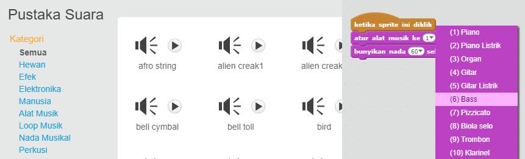
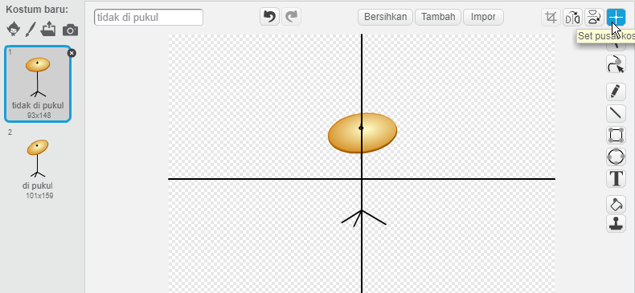

\--- challenge \---

## Tantangan: buat band Anda sendiri

Gunakan apa yang telah Anda pelajari dalam proyek ini untuk membuat band Anda sendiri! Anda dapat membuat instrumen apa pun yang Anda suka - lihat suara dan instrumen yang tersedia untuk mendapatkan beberapa ide.

Namun, instrumen Anda tidak harus masuk akal. Misalnya, Anda bisa membuat piano yang terbuat dari muffin!

Serta menggunakan sprite yang ada, Anda juga dapat menggambar sprite Anda sendiri.

## \--- jatuh \---

## title: Mengapa sprite saya 'melompat' ketika itu mengubah kostum?

+ Ketika membuat sprite Anda sendiri, Anda mungkin menemukan bahwa ketika Anda mengklik sprite, itu 'melompat' karena mengubah kostum. Ini karena kedua kostum itu tidak berpusat di tempat yang sama.

Untuk memperbaikinya, klik **Set pusat kostum** pada kedua kostum, dan pastikan pusatnya berada pada titik yang sama di kedua kostum.

\--- /jatuh \---

Jika Anda memiliki mikrofon, Anda dapat merekam suara Anda sendiri, atau bahkan menggunakan webcam untuk memukul instrumen Anda!

\--- / tantangan \---