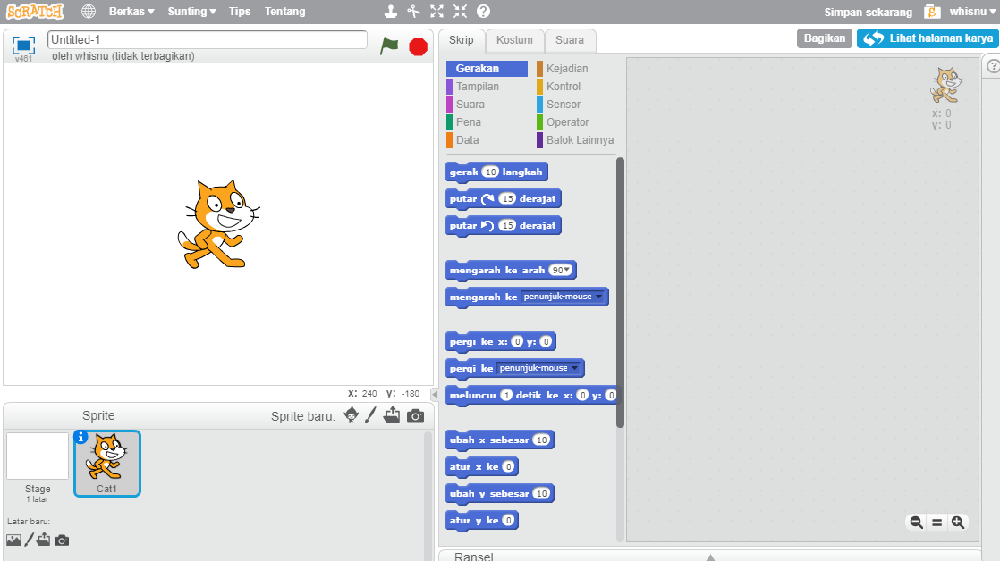
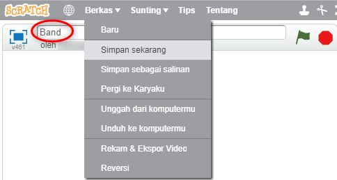

## Sprite

Sebelum kamu mulai membuat kode, kamu harus menambahkan 'sesuatu' pada kode. Dalam Scratch, 'sesuatu' itu disebut **sprite**.

\--- task \---

Buka proyek Scratch baru.

**Online:** buka proyek Scratch online yang baru di [rpf.io/scratch-new](http://rpf.io/scratch-new){:target="_blank"}.

**Offline:** buka proyek baru di editor offline.

Jika Kamu perlu mengunduh dan menginstal editor Scratch offline, Kamu dapat menemukannya di [rpf.io/scratchoff](http://rpf.io/scratchoff){:target="_blank"}.

Tampak seperti ini:

\--- /task \---

\--- task \---

The cat sprite that you can see is the Scratch mascot. You don't need it for this game, so get rid of it by clicking on the X in the corner.

\--- /task \---

\--- task \---

Selanjutnya, klik pada **Pilih sprite dari pustaka** untuk membuka daftar semua sprite Scratch.

\--- /task \---

\--- task \---

Gulir ke bawah hingga terlihat sprite drum. Klik pada drum untuk menambahkannya ke proyekmu.

\--- /task \---

\--- task \---

If you are signed in to your Scratch account, type the title of your project into the project title box at the top of the screen:

**Tip:** Give your projects helpful names so that you can easily find them when you have lots of projects.

Next, click on File, and then on Save now to save your project.

If you are not online or don't have a Scratch account, you can save a copy of your project by clicking on **Save to your computer** instead.

\--- /task \---