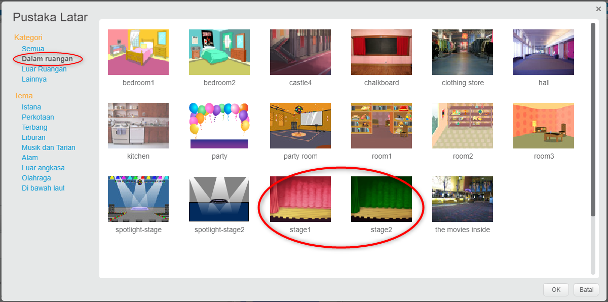

## Panggung

**Panggung** adalah area di sebelah kanan, dan di sinilah proyek kamu berada. Anggap saja sebagai area pertunjukan, seperti panggung sungguhan!

\--- task \---

Saat ini, panggungnya putih dan terlihat sangat membosankan! Tambahkan latar belakang padanya dengan mengklik **Pilih latar belakang**.

\--- /task \---

\--- task \---

Klik pada **Dalam Ruangan** dalam daftar di bagian atas. Kemudian klik pada latar belakang teater.

\--- /task \---

\--- task \---

Click and drag the drum to the bottom of the Stage.

\--- /task \---

\--- task \---

Your stage should now look similar to this:

\--- /task \---