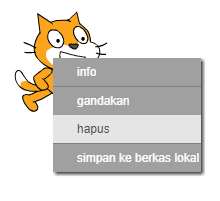

## Sprite

Sebelum Anda dapat memulai coding, Anda harus menambahkan 'hal' ke kode. Dalam Scratch, 'benda' ini disebut **sprite**.

+ Pertama, buka editor Scratch. Anda dapat menemukan editor Scratch online di <a href="http://jumpto.cc/scratch-new" target="_blank">jumpto.cc/scratch-new</a>. Terlihat seperti ini:
    
    

+ Kucing sprite yang bisa Anda lihat adalah maskot Scratch. Mari kita hilangkan dengan mengklik kanan dan kemudian mengklik **delete**.
    
    

+ Selanjutnya, klik **Pilih sprite dari library** untuk membuka daftar semua sprite Scratch.
    
    

+ Gulir ke bawah sampai Anda melihat sprite drum. Klik pada drum, dan klik **OK** untuk menambahkannya ke proyek Anda.
    
    

+ Klik ikon **menyusut** , lalu klik pada drum beberapa kali untuk membuatnya lebih kecil.
    
    

Beri nama pada program Anda dengan mengetikkan salah satunya ke dalam kotak teks di sudut kiri atas.

Anda kemudian dapat mengklik **File** dan kemudian **Save now** untuk menyimpan proyek Anda. Jika Anda tidak memiliki akun Scratch, Anda dapat menyimpan salinan proyek Anda dengan mengklik **Unduh ke komputer Anda** sebagai gantinya.

