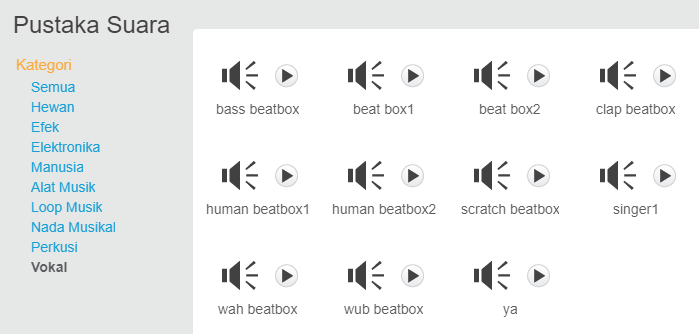

## Membuat penyanyi

Sekarang tambahkan penyayi pada band milikmu!

\--- task \---

Tambahkan sprite penyanyi ke Panggungmu.


[[[generic-scratch3-sprite-from-library]]]

\--- /task \---

\--- task \---

Sebelum kamu bisa membuat penyanyimu bernyanyi, kamu perlu menambahkan suara ke sprite penyanyimu. Pastikan kamu telah memilih sprite penyanyimu, lalu klik pada tab Suara, dan klik pada ** Pilih suara**:


\--- /task \---

\--- task \---

Klik pada **Suara** dalam daftar di bagian atas, dan kemudian pilih suara untuk ditambahkan ke sprite milikmu.



\--- /task \---

\--- task \---

Untuk menggunakan suara, tambahkan blok kode berikut ke sprite penyanyimu:

```blocks3
saat sprite ini diklik
mainkan suara (penyayi1 v) sampai selesai
```

\--- /task \---

\--- task \---

Klik penyanyimu di atas panggung dan lihat apa yang terjadi. Apakah dia bernyanyi?

\--- /task \---