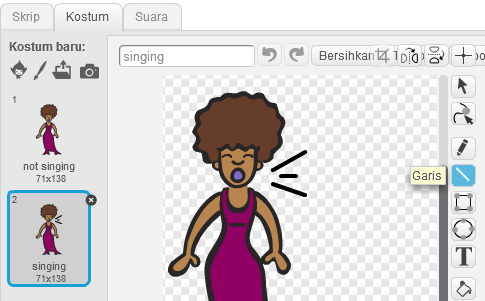
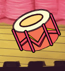

## Kostum

Sekarang mari Kita buat penyayimu seperti sedang bernyanyi!

\--- task \---

Kamu bisa mengubah penampilan penyayi sprite milikmu saat diklik dengan membuat kostum baru. Klik pada tab kostum, Dan kamu akan melihat kostum penyayi.


\--- /task \---

\--- task \---

Klik Kanan pada kostum dan kemudian klik **duplikat** untuk membuat duplikatnya.


\--- /task \---

\--- task \---

Klik pada kostum baru (sebutlah 'Penyayi2'), kemudian pilih peralatan garis dan garis gambar maka penyayimu akan seolah-olah mengeluarkan suara.



\--- /task \---

\--- task \---

Nama-nama kostum tidak begitu membantu saat ini. Ketik ke dalam kotak teks kostum untuk mengubah nama mereka menjadi 'tidak bernyanyi' dan 'bernyanyi'.


\--- /task \---

\--- task \---

Sekarang kamu memiliki dua kostum berbeda untuk penyanyimu, kamu dapat memilih kostum mana yang akan ditampilkan! Tambahkan dua blok kode ini ke sprite penyanyimu:

```blocks3
ketika sprite ini diklik
+ ganti kostum ke (bernyanyi v)
mainkan suara (penyanyi1 v) sampai selesai
+ beralih kostum ke (tidak bernyanyi v)
```

Blok kode untuk mengganti kostum ada di bagian `Tampilan` {: class = "block3looks"}.

\--- /task \---

\--- task \---

Klik pada penyanyimu di atas panggung. Apakah dia terlihat seperti sedang bernyanyi?

\--- /task \---

\--- task \---

Sekarang buat drum milikmu terlihat seperti dimainkan!



- Gunakan instruksi untuk mengubah kostum penyanyi sprite milikmu untuk membantumu.

Ingatlah untuk menguji apakah kode barumu berfungsi!

\--- /task \---