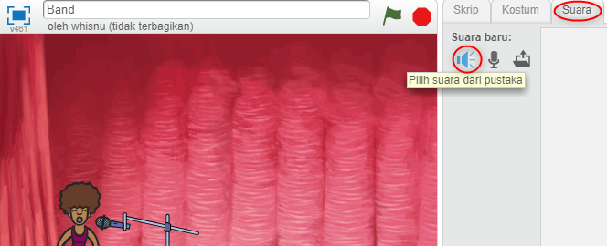

## Membuat penyanyi

Mari tambahkan penyanyi ke band Anda!

+ Tambahkan dua sprite lain ke panggung Anda: penyanyi dan mikrofon.
    
    

+ Sebelum Anda dapat membuat penyanyi bernyanyi, Anda perlu menambahkan suara ke sprite Anda. Pastikan bahwa Anda telah memilih penyanyi Anda, lalu klik tab Suara, dan klik **Pilih suara dari perpustakaan**:
    
    

+ Jika Anda mengklik **Vokal** di sisi kiri, Anda kemudian akan dapat memilih suara yang cocok untuk ditambahkan ke sprite Anda.
    
    

+ Sekarang setelah suara telah ditambahkan, Anda dapat menambahkan kode ini ke penyanyi Anda:
    
    ```blocks
        ketika sprite ini diklik memainkan suara [singer1 v] sampai selesai
    ```

+ Klik penyanyi Anda dan lihat apa yang terjadi. Apakah dia bernyanyi?