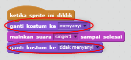

## Kostum

Mari kita buat penyanyi Anda terlihat seperti dia bernyanyi!

+ Anda juga dapat mengubah cara sprite penyanyi Anda terlihat ketika diklik dengan membuat kostum baru. Klik tab Kostum, dan Anda akan melihat gambar penyanyi.
    
    

+ Klik kanan pada kostum dan klik **duplikat** untuk membuat salinan kostum.
    
    

+ Klik pada kostum baru (disebut 'Singer2'), lalu pilih alat garis dan tarik garis untuk membuatnya terlihat seperti penyanyi Anda membuat suara.
    
    

+ Nama-nama kostum tidak terlalu membantu saat ini. Ubah nama dua kostum sehingga mereka disebut 'tidak bernyanyi' dan 'bernyanyi' dengan mengetikkan nama baru setiap kostum ke dalam kotak teks.
    
    

+ Sekarang Anda memiliki dua kostum berbeda untuk penyanyi Anda, Anda dapat memilih kostum mana yang ditampilkan! Tambahkan dua blok ini ke penyanyi Anda:
    
    
    
    Blok kode untuk mengubah kostum ada di bagian `Tampak`{: class = "blocklooks"}.

+ Klik penyanyi Anda. Apakah dia terlihat seperti sedang bernyanyi?