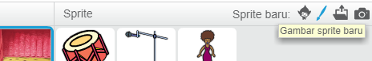
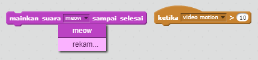

## Tantangan: tingkatkan band kamu

Gunakan apa yang telah kamu pelajari dalam proyek ini untuk membuat band kamu sendiri! Kamu dapat membuat instrumen apa pun yang kamu suka - lihat sprite dan suara instrumen yang tersedia untuk mendapatkan beberapa ide.


```blocks3
ketika sprite ini diklik
atur instrumen ke (\ (1 \) Piano v)
mainkan note (60) untuk (0,25) ketukan
```

Instrumenmu tidak harus realistis. Misalnya, kamu bisa membuat piano yang terbuat dari muffin!


Kamu dapat menggunakan lebih banyak sprite dari pustaka, dan kamu juga bisa mengecat sprite kamu sendiri!



## \--- collapse \---

## title: Mengapa sprite saya 'melompat' ketika mengubah kostum?

Saat membuat sprite kamu sendiri, kamu mungkin menemukan bahwa ketika kamu mengklik sprite, terlihat seperti 'melompat' saat mengubah kostum. Hal ini karena kedua kostum tidak terpusat di tempat yang sama.

Untuk memperbaikinya, pastikan bahwa pusat kostum sprite kamu sama.

\--- /collapse \---

Jika kamu memiliki mikrofon, kamu dapat merekam suara kamu sendiri, dan kamu bahkan dapat menggunakan webcam untuk membunyikan instrumenmu!

