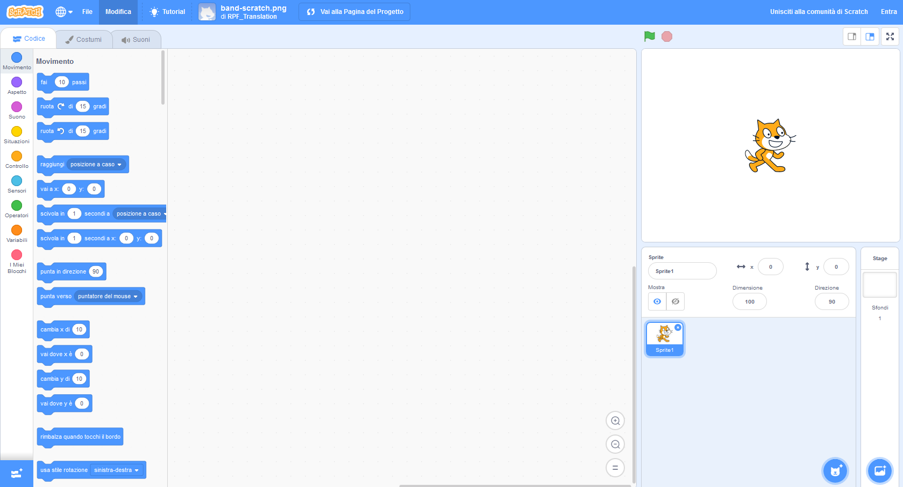
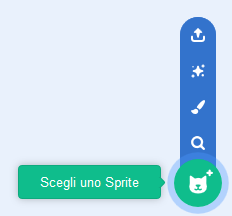

## Sprite

Prima di poter cominciare a programmare, hai bisogno di aggiungere al tuo progetto un ‘oggetto’ da programmare. In Scratch questi ‘oggetti’ si chiamano **sprite**.

\--- compito \--- Apre un nuovo progetto Scratch.

**Online:** apri un nuovo progetto Scratch online su [rpf.io/scratch-new](http://rpf.io/scratch-new){:target="_blank"}.

**Offline:** apri un nuovo progetto nell'editor offline.

Se hai bisogno di scaricare ed installare l'editor Scratch offline, puoi trovarlo su [rpf.io/scratchoff](http://rpf.io/scratchoff){:target="_blank"}.

Apparirà così:

 \--- / compito \--- \--- compito \--- Il gatto sprite che vedi è la mascotte di Scratch. Non ne hai bisogno per questo gioco, quindi eliminalo cliccandoci sopra col tasto destro e scegli **Elimina**.

 \--- /compito \---

\--- compito \--- Adesso fai clic su **Scegli sprite dalla libreria** per aprire un elenco di tutti gli sprite di Scratch.

 \--- /compito \---

\--- compito \--- Scorri in basso fino a uno sprite del tamburo. Clicca su un tamburo per aggiungerlo al tuo progetto.

\--- /compito \---

\--- compito \---

Clicca e trascina il tamburo sul fondo del palco.

\--- /compito \---

\--- task \--- Assegna un nome al tuo programma digitandolo nella casella di testo in alto.

Adesso clicca su **File**, quindi su **Salva ora** per salvare il progetto.

Se non sei online o non hai un account Scratch, puoi salvare una copia del progetto cliccando su **Salva sul computer**.

 \--- /task \---