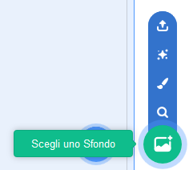

## Il palco

Il **Palco** è l'area sulla destra, ed è dove il tuo progetto prende vita. Pensalo come un luogo di spettacolo, proprio come un vero palcoscenico!

\--- task \--- Al momento, il palco è bianco e sembra piuttosto noioso! Aggiungi uno sfondo cliccando su **Scegli uno sfondo**.

 \--- /task \---

\--- task \--- Clicca su **Indoors** nell'elenco in alto. Quindi clicca su uno sfondo del teatro.

 \--- /task \---

\--- task \--- Il tuo stage dovrebbe ora somigliare a questo:

 \--- /task \---