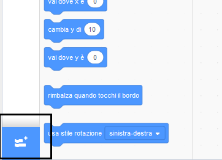
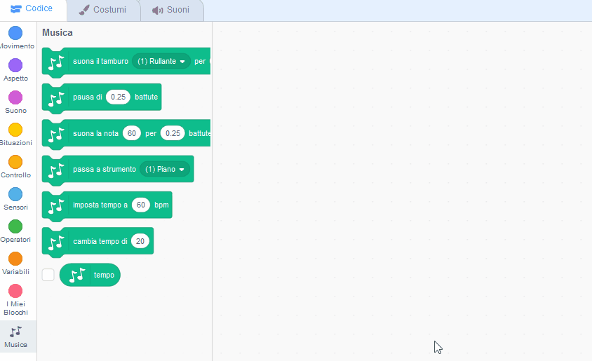

## Creare un tamburo

Ora aggiungerai il codice al tuo tamburo così che il tamburo emetta un suono quando viene cliccato.

Puoi trovare i blocchi di codice nel pannello ‘Script’. Sono di vari colori, a seconda del tipo!

--- task ---

Per prima cosa aggiungi l'estensione **Musica** in modo da poter suonare gli strumenti.

Clicca sul pulsante **Aggiungi un'estensione** nell'angolo in basso a sinistra.



Fare clic sull'estensione **Musica** per aggiungerla.


--- /task ---

--- task --- Clicca sullo sprite del tamburo, quindi trascina questi due blocchi nell'area del codice a destra:

```blocks3
when this sprite clicked
play drum ((1) Rullante v) for (0.25) beats
```

--- no-print ---



--- /no-print ---

Assicurati che i blocchi siano collegati (come i mattoncini LEGO).

--- /task ---

--- task --- Clicca sul tamburo per provare il tuo nuovo strumento! --- /task ---