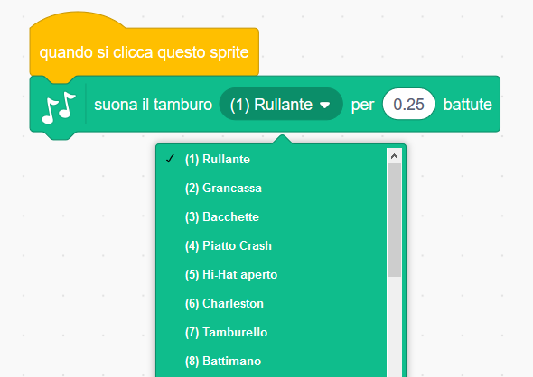
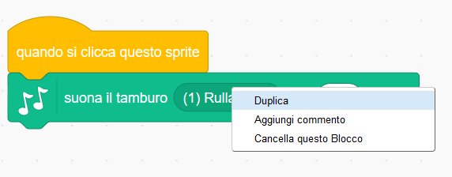

## Sfida: migliora il tuo tamburo

Riesci a cambiare il suono che il tamburo produce quando viene cliccato?



Riesci anche a far sì che il tamburo emetta un suono quando viene premuto il tasto spazio? Dovrai utilizzare questo blocco `Situazioni`{:class="block3events"}:

```blocks3
when [spazio v] key pressed
```

Se vuoi copiare il codice, clicca con il tasto destro e quindi scegli **duplica**.

