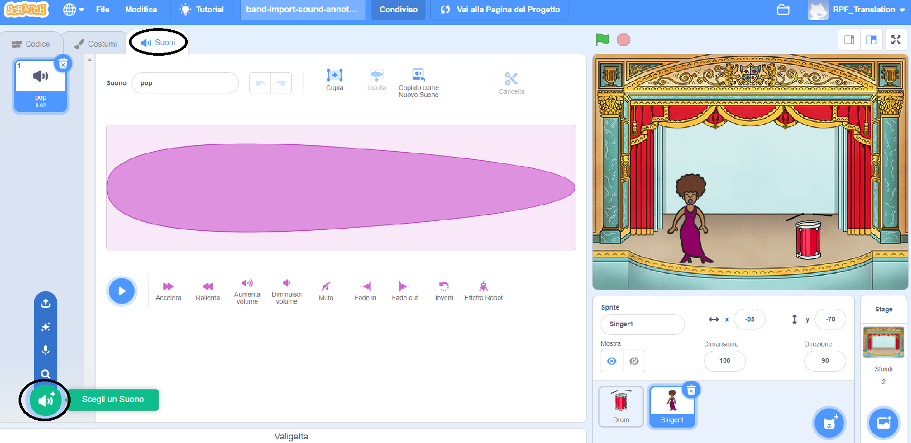
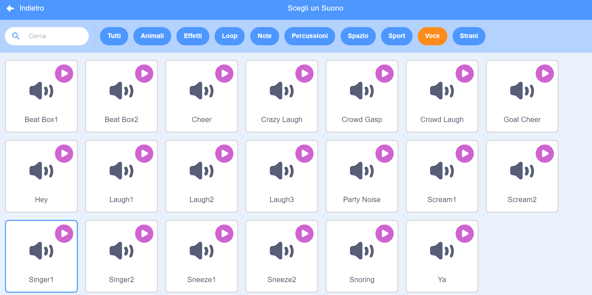

## Creare una cantante

Ora aggiungerai una cantante alla tua band!

\--- task \---

Aggiungi uno sprite della cantante al tuo Stage.


[[[generic-scratch3-sprite-from-library]]]

\--- /task \---

\--- task \---

Prima di far cantare la tua cantante, devi aggiungere un suono al suo sprite. Assicurati di aver selezionato lo sprite della cantante, quindi clicca sulla scheda Suoni e seleziona **Scegli un suono**:



\--- /task \---

\--- task \---

Click on **Voice** in the list at the top, and then choose a sound to add to your sprite.



\--- /task \---

\--- task \---

To use the sound, add the following code blocks to your singer sprite:

```blocks3
when this sprite clicked
play sound (singer1 v) until done
```

\--- /task \---

\--- task \---

Click on your singer on the stage and see what happens. Does she sing?

\--- /task \---