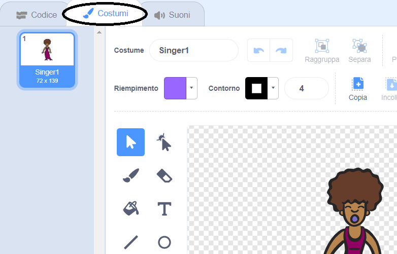
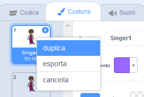
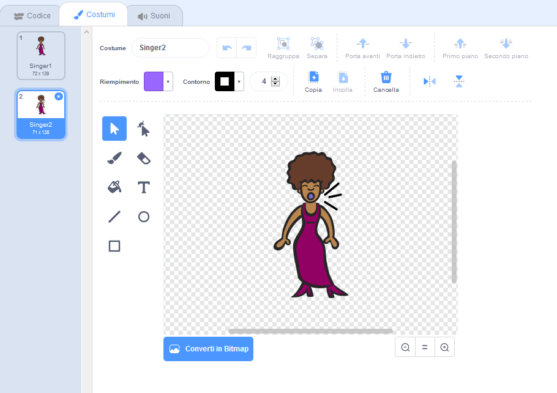
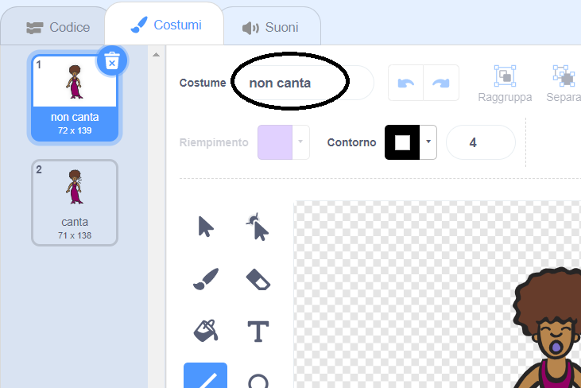

## I Costumi

Ora farai sembrare che il tuo cantante stia cantando!

--- task --- Puoi cambiare l'aspetto dello sprite del cantante quando viene cliccato creando un nuovo costume. Clicca sulla scheda Costumi e vedrai il costume del cantante.

 --- /task ---

--- task --- Clicca con il pulsante destro del mouse sul costume e quindi seleziona **duplica** per crearne una copia.

 --- /task ---

--- task --- Clicca sul nuovo costume (chiamato 'Singer2'), quindi seleziona lo strumento linea e traccia le linee in modo che il tuo cantante sembri emettere un suono.

 --- /task ---

--- task --- I nomi dei costumi non sono molto utili al momento. Digita nelle caselle di testo dei costumi per cambiarne il nome in "non canta" e "canta".

 --- /task ---

--- task --- Ora che hai due costumi diversi per il tuo cantante, puoi scegliere quale costume mostrare! Aggiungi questi due blocchi di codice al tuo sprite del cantante:

```blocks3
when this sprite clicked
+switch costume to (canta v)
play sound (singer1 v) until done
+switch costume to (non canta v)
```

Il blocco di codice per la modifica del costume si trova nella sezione `Aspetto`{:class="block3looks"}. --- /task ---

--- task --- Clicca sul tuo cantante sul palco. Sembra che stia cantando? --- /task ---

--- task --- Ora fai in modo che il tuo tamburo sia colpito!


- Usa le istruzioni per cambiare il costume dello sprite del tuo cantante per aiutarti.

Ricordati di verificare che il tuo nuovo codice funzioni! --- /task ---