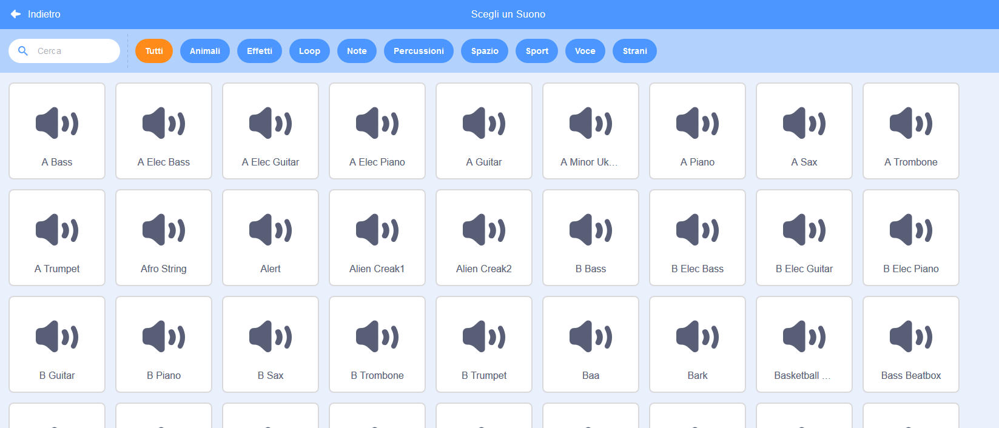
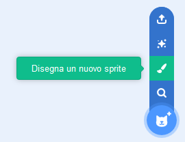
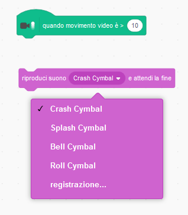

## Sfida: migliora la tua banda

Usa quello che hai imparato in questo progetto per formare la tua band! Puoi creare tutti gli strumenti che vuoi: guarda gli sprite e i suoni disponibili per farti un'idea.



```blocks3
when this sprite clicked
set instrument to ((1) Piano v)
play note (60) for (0.25) beats
```

Tuttavia, i tuoi strumenti non devono essere realistici. Ad esempio, potresti creare un piano fatto di muffin!


Puoi scegliere più sprite dalla libreria e puoi anche dipingere i tuoi sprite!



--- collapse ---
---
title: Perché il mio sprite "salta" quando cambia costume?
---

Mentre crei il tuo sprite, potresti notare che quando clicchi sullo sprite, questo "salta" mentre cambia costume. Questo perché i due costumi non sono centrati nello stesso punto.

Per risolvere questo problema, assicurati che i costumi dello sprite siano centrati.

--- /collapse ---

Se hai un microfono, puoi registrare i tuoi suoni e puoi persino usare una webcam per suonare i tuoi strumenti!

